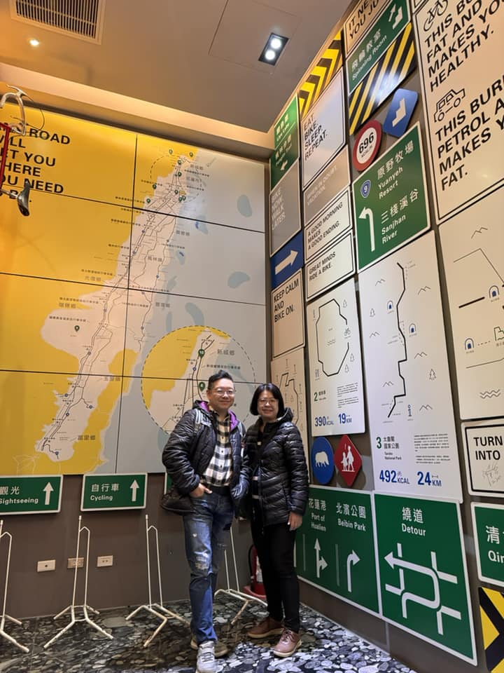

## 璽賓行旅住宿+必吃林記蔥油餅

今年我們選擇在花蓮度過農曆新年，或許是因為許多人都出國旅遊了，花蓮顯得格外寧靜與清爽。在這片好山好水之間，我們度過了三天悠閒的時光，留下了許多美好的回憶。

#### 住宿：Kadda Hotel 璽賓行旅

這幾年來，璽賓行旅可以說是花蓮最受歡迎的休閒旅館之一。這裡不僅擁有令人驚艷的無邊際游泳池，還提供自行車友善的房間，讓騎行愛好者倍感貼心。早餐吧和旁邊的餐廳選擇豐富且精緻，工作人員的服務態度也非常親切。最讓人印象深刻的是全部都是海景房，無論是來騎車、跑馬拉松，還是全家出遊，這裡都是絕佳的選擇。值得一提的是，旅館還支援街口支付，非常方便 XD

#### 7-ELEVEN 權營門市

位於璽賓行旅對面的7-ELEVEN權營門市，不僅商品齊全，還設有24小時營業的果汁 Bar和酒Bar，提供調酒和生啤酒，吸引了不少人在這裡小酌一杯，氣氛輕鬆愉快。

#### 林記 明禮路葱油餅

除夕當天，許多店家都休息了，想吃個蔥油餅還得是林記啊。他們的葱油餅和蛋是分開炸的，最後再用餅將蛋包裹起來，口感酥脆，價格只要30元，絕對是物超所值的美味。

#### 公正包子

雖然有些人對公正包子的評價不一，但我們覺得好吃。特別是包子皮，稍微厚實且帶有甜味，吃起來很有滿足感。這裡也支援街口支付，方便又快捷。

#### 雲山水夢幻湖

雖然我們到訪時，落羽松已經開始落葉，但整個區域依然充滿了詩意，適合散步和拍照。特別值得一提的是，馬路對面有一位原住民老伯和他的外配在賣大腸包小腸，味道意外地好，哈哈。

#### 赤物日式燒肉

初一晚上，我們選擇在赤物日式燒肉用餐。老闆娘和員工的服務非常親切，換網子的頻率也很高。肉品品質中上，生蠔和鮮蝦都非常新鮮。除了燒肉，這裡還提供火鍋和豐富的自助青菜，整體用餐體驗非常愉快。這裡同樣支援街口支付。

#### V Tree Cafe

這家新開幕不滿一年的文青咖啡廳，吸引了許多人前來拍照打卡。雖然價格稍高，但餐點和飲料都非常出色。西式點心和中式餐點都值得推薦，尤其是紅燒肉餐和泰式椒麻雞腿飯，味道令人驚艷。

#### 將軍府

將軍府這個景點已經不太像傳統的古蹟，裡面開了很多餐廳。我特別喜歡甜食，這次買了陳耀訓聯名將軍府的「OOA」金沙芋泥可頌和菩提餅舖的奶油酥條，兩者都非常美味。

---

## 東大門夜市煙火+撒固兒步道親子玩

#### 東大門夜市

來到花蓮，當然不能錯過夜市王 - 東大門夜市。這次正好趕上燈會展演，我們欣賞了燈光水舞煙火秀，還品嚐了西瓜汁、超級大熱狗、蔣記官財板、古早味潤餅和家傳東山鴨頭等美食，夜市氣氛熱鬧非凡。

除了美食，我們還參觀了幾個景點：

#### 媽媽農場

這是一個適合全家大小遊玩的地方，不收門票，園區內有馬、綿羊、孔雀等動物，甚至還有罕見的白孔雀，風景也非常優美。

#### 奇萊鼻燈塔

這是台灣少見的五角形燈塔，雖然燈塔本身在管制範圍內，但沿著左側圍牆外的小路走，可以欣賞到更美的風景，非常適合拍照。

#### 撒固兒步道和瀑布

這是一個適合踏青的好地方，慢慢走一圈大約需要40分鐘，沿途可以享受大自然的芬多精洗禮。不過要注意，不要在山上吃東西，因為可能會遇到猴子來搶食哦！

#### 星巴克洄瀾門市

這是亞洲首間以貨櫃打造的星巴克門市，由建築大師隈研吾設計，已經成為一個熱門的觀光景點。

#### 鯉魚潭

這裡可以騎單車，也可以租鴨子船遊湖，和七星潭一樣，都是花蓮的經典旅遊景點。

這次花蓮之行雖然只有三天，但整體感覺非常好。雖然東部旅遊業因之前的天災影響，部分景點如太魯閣等地尚未完全恢復，但我們依然推薦大家來東部走走，不僅能享受美景，也能幫助當地產業復甦。期待下次再來花蓮，繼續探索這片美麗的土地！

