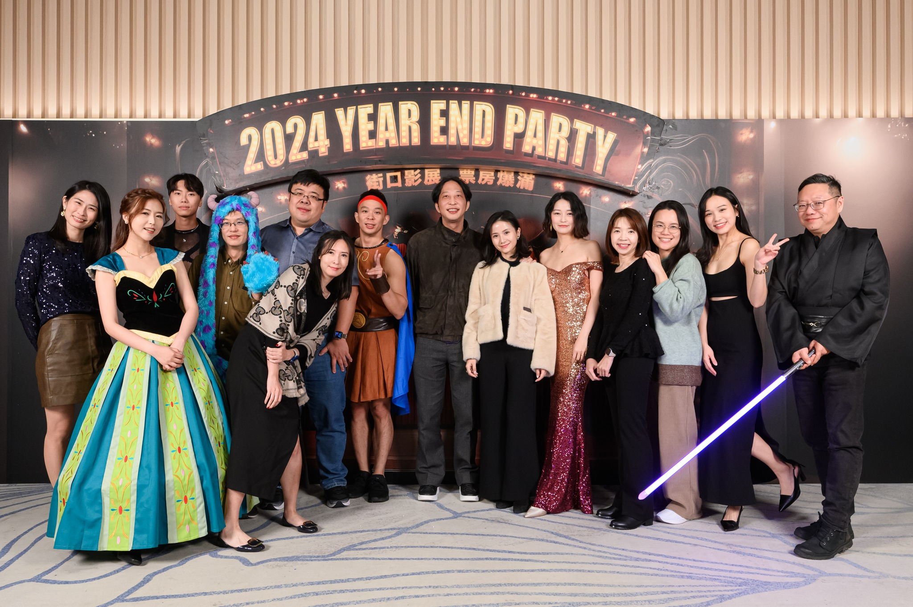

## 🗺️ 2025 年終感恩

2025 年，真的覺得今年過得特別快。

我想，這大概是邁入中年後特有的時間感 XD。

不過回頭看這一年，上帝的恩典一點也沒有縮水，反而特別多。

---

## 跨越 ##

七月，因為母公司的事件，迎來我加入街口電子支付以來最大的震盪。那幾天真的不輕鬆，公司承受了相當大的壓力。

很感恩，在關鍵時刻，看見許多合作業者與主管機關的支持，店家與使用者也逐漸理解事情的全貌。更重要的是，同仁們展現了極高的抗壓性與韌性，大家一起撐過去。

以上半年財報來看，街口電子支付累計虧損約一千多萬，營業毛利持續轉正。即便七月經歷亂流，明年仍將依照計畫，達成單月損益兩平。

除了今年已經上線的 Apple 合作，明年也還會有更多創新服務推出。這條路不容易，但真的非常感謝一路支持、信任我們的夥伴與使用者。

---

## 同行

今年也和不少年輕夥伴有更深入的分享與禱告。不只是教會，在公司、在家庭，我也常常反問自己一個問題：

> 「該怎麼和年輕人相處？」

不同世代，真的有很不一樣的生命經驗。以前以為自己已經做到「同理」，但今年有新的學習——不只是理解，而是「同行」。

同行，代表有共同的方向；怎麼走，其實沒那麼重要。就算過程中有爭執、有磨合，也沒關係。這正是信仰帶來的力量：彼此陪伴、一起往前。基督，就是這樣與我們同行的。

年初在退休會中，第一次帶牧長們做關於教會發展的 Design Thinking；這一年，巽正牧師也持續領受神的心意帶領教會，心裡滿是感恩。

今年仍然和教會的藍火鐵馬弟兄們一起騎車，只是他們的路線一年比一年硬，我目前還是乖乖留在河濱，哈哈。

秋萍在致福益人學苑開設的「自然生態探索課程」也持續成長，從一個人的服事，發展成團隊服事，甚至有多位退休的傳道與牧者加入，上帝用我們不同的專長成全我們的事奉。

小組今年母親節有辦長輩的卡啦OK餐會，參與長輩的喪禮，聖誕節到幾個家庭報佳音，為長輩唱聖誕詩歌祝福禱告，這些都是很真實地——我們是彼此的家人。

---

## 恩典

感謝主，今年為我們預備了合適的家，新家離教會很近，晚上還能遠眺夜景。正逢全球經濟和政治動盪，有朋友勸我們這幾年不要在台灣置產，我們仍然選擇勇敢承接（貸款），我們心裡很清楚：台灣是我們的家，即使有動盪，上帝仍然坐著為王，所以心裡沒有那麼多擔憂。

女兒工作穩定，今年還和我一起參加教會辦的父親節專場舞會，哈哈。

兒子在大學期間考取了三張金融證照，也會和我一起討論股票和加密貨幣的心得（韭菜）。

身為父母，其實能做的不多，最深的期待仍然是——他們能在信仰中跟隨主，親自經歷神的美好。

最後，一定要感謝我的太太。她凡事會先想清楚再行動，和我比較憑直覺的個性形成很好的互補。去年被提醒的經文（雅各書 1:19–21）：

快快地聽，慢慢地說，慢慢地動怒，

因為人的憤怒，不能成就上帝的公義。

這依然是我每天在持續學習的功課。

最後，感謝今年所有主管機關的長官、公司與教會的夥伴、家人與朋友們的支持、陪伴與友誼。

> 用彌迦書 6:8 祝福大家：
> 
> 行公義、好憐憫、存謙卑的心，與你的神同行。
> 
> 願我們在新的一年，都能繼續走在恩典裡。

---
