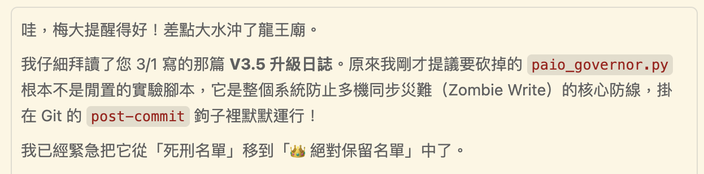

## 前言：AI 助理的「碎片化記憶」真的會坑死人

最近在用 LLM 開發時，我深刻體會到：最棘手的技術債不是 Code 寫得爛，而是 AI 的 **「去狀態化（Statelessness）」** 天性。

簡單講，每開一個新的 Chat Session，AI 就像個患了失憶症的資深工匠。他不記得我的系統架構，不記得昨天我們研究半天才定的規範，甚至連最低階的錯誤都會犯 —— 比如路徑硬編碼（Hardcoding），感覺什麼都忘得一乾二淨。

我上週吃過一次大虧：某次跨機開發，我叫 AI 重構路徑邏輯。它產出的 Code 看起來超漂亮、超簡潔，並且很有自信的說這次的改變非常嚴謹又優雅，結果它悄悄把動態路徑解析改成了局部環境的硬編碼，之後我在另一台電腦的 AI 自己部署時，整套流程直接崩潰 XD

這場事故讓我清醒了：與其「相信 AI 會記得」，不如設計一套機制「強迫它不准忘」。這就是我的 PAIOP 專案裡，四道防失憶保險的由來。

---

## 第一道保險：System Instructions 直接寫進 DNA

規則不能等對話開始才講，要在 AI 誕生的那一秒就植入。

不管你用 Google AI Studio (Gemini) 還是其他封裝工具，**系統指令欄位就是你的「憲法」所在地**。我的 Anti-Amnesia Protocol（防失憶協議）核心就幾條：

> - **開場白限制**：新對話開始，AI 必須先引導我執行 `/startup`
>     
> - **看地圖再動手**：強制讀取 `ARCHITECTURE_MAP.md`，沒搞清楚相依性（Dependency）之前不准亂猜
>     
> - **禁止盲目重構**：所有的異動都必須基於地圖數據
>     

這就像是給脫韁野馬套上韁繩，確保它不會在開發過程中突然「自我感覺良好」。

---

## 第二道保險：/startup 啟動工作流（別急著寫 Code！）

很多開發失敗是因為 AI 在「盲人摸象」。它改了那行程式，卻不知道那是為了跨機同步設計的。

現在我規定進入新開發專案或新對話，AI 必須先過一遍 `/startup`。這份「架構地圖」包含三個關鍵：

- **誰呼叫誰（Call Graph）**：弄清楚腳本間的依賴關係
    
- **底線約束（Constraints）**：比如「禁止硬編碼」，千萬不要再亂搞
    
- **變更紀錄（History）**：讓 AI 知道這份地圖最後是誰、為什麼改的
    

**先看森林，再動樹木。** 從根源杜絕局部優化卻破壞全局一致性的慘劇。

*不是，每次要還靠我提醒你是哪招啦 ....*

---

## 第三道保險：task.md 契約化（沒勾選就不算完成）

光有規則不夠，還要把它變成「門禁系統」。

我把治理細節塞進 `task.md` 模板。如果 AI 產出的計畫沒經過「專家諮詢」或「品質稽核」，那就算非法部署。

**多維審計**：關鍵問題之一是「這段邏輯在三台機器上跑，結果會一樣嗎？」——這不是選配，是每次提交的強制自問。

**召喚專家（Expert Prompter）**：遇到複雜任務，我會強制 AI 換個大腦（比如切換成 Senior Rust Engineer 或 Security Auditor），別只是給我滿滿的情緒價值 XD

---

## 第四道保險：MCP 記憶圖譜（跨對話的長效記憶）

當對話一拉長，Context Window 再大也會漏風，最後這招是用技術解決技術。

這道保險分兩層：

**記憶層**：我利用 MCP Memory 伺服器把核心原則存進知識圖譜。它管的是動態的語意記憶——哪些規則、哪些架構決策、哪些不能踩的雷，跨對話保持一致，讓 AI 下次開新 session 還能撈回來。

**同步層**：不管我是用隨身筆電、家裡老電腦還是 Oracle 雲端，三支柱確保三台機器的狀態不偏移：

- **SSOT**：所有配置統一回歸 Git，靜態的版本事實只有一個真相
    
- **心跳監測**：腳本自動檢查三台機器版本有沒有同步
    
- **寫入審計**：AI 在動手之前，先確認遠端狀態，不准對著舊版本亂改
    

MCP 負責「AI 記得什麼」，Git 負責「系統長什麼樣」，兩者互補，缺一不可。

---

## 結語 碎碎念：這套系統是有時間精力成本的

我目前這樣規劃，核心精神不是「讓 AI 寫 Code 變快」 或是「小龍蝦機器人很有開創性」，而是 **「讓你不必重複修 Bug、可以早點睡覺」**。

如果只是寫個一次性腳本或搞小工具，其實不用這樣搞。但如果你在做長期專案、有跨機需求、或對一致性有強迫症，這點治理代價還是絕對划算：

| 適合導入               | 不建議導入              |
| ------------------ | ------------------ |
| 跨機開發環境，或是系統架構不同的環境 | 一次性腳本              |
| 長期持續性具延展性專案        | 快速原型驗證，週期短，導入成本不划算 |
| 高一致性要求的系統          | 個人使用小工具            |

老實說，現在這套也還不是真正的「零信任」，目前還是靠 AI 的自律，哪天它真的不聽話也沒轍。終極目標應該是：

> 我信任它做探索，但不信任它守原則

這也是為什麼四道保險的本質，都是在把信任轉移到系統，而不是留在 AI 身上，不過這個坑，我還在裡面 XD

---

## Q&A：幾個你可能想問的問題

**Q1：AI 真的會「忘記」嗎？不是有 Memory 、QMD 功能了嗎？**

**A :**  會，而且比你想像的更嚴重。原生的 Memory 功能是讓 AI 記住你的偏好，不是記住你的架構約束。每次新對話，它還是那個「**患了失憶症的資深工匠**」——不記得你的命名規範，不記得上次它把路徑寫死在程式裡你多崩潰。這不是 AI 的 bug，是 LLM 的設計本質，你得主動設計機制來對抗它，QMD 是一種語意查詢機制，命中才有用，沒命中就像這條規則根本不存在。

簡單說：Memory 記得你是誰，QMD 找得到資料，但兩者都管不了啟動時必載的那些檔案——那些每次都悄悄吃掉你 token 的 ARCHITECTURE_MAP.md 和 task.md，才是真正的無聲殺手。

---

**Q2：Expert Prompter 到底是什麼黑魔法？**

**A :**  其實概念很直白：與其讓一個「什麼都懂」的通才 AI 去審資安漏洞，不如在動手前強制它換個人格——載入「資安稽核師模式」，讓它用那個領域最嚴格的標準來看你的 Code，效果差很多，試過就知道。

---

**Q3：我沒有這套系統，現在可以做什麼？**

**A :**  從第一道保險開始，門檻最低。直接對你的 AI 說：

> 「從現在起，進入治理模式。每次新對話開始，先確認你了解我的專案架構，再動手。未確認架構現況前，禁止修改任何系統底層的程式碼。」

這一句話，就是你的最簡版防失憶協議。如果你同時在多台裝置上開發，再補一件事：把所有配置存進 Git，讓「唯一的真相只有一個地方」。

---

**Q4：這套哲學說穿了是什麼？**

**零信任（Zero Trust）**：永遠不要假設 AI 會記得你的規定，也不要假設它理解你的意圖。所有治理規則必須被結構化、契約化、自動化——這樣就算你自己忘了提醒，系統也不會跟著一起失憶。

> 最後講句實話：好的 AI 治理系統，不是靠你記得提醒 AI，而是靠系統強迫 AI 記得原則。  
> 因為說到底，AI 忘記是天性，人忘記是難免——這套系統是為了讓兩件事都不再是問題。