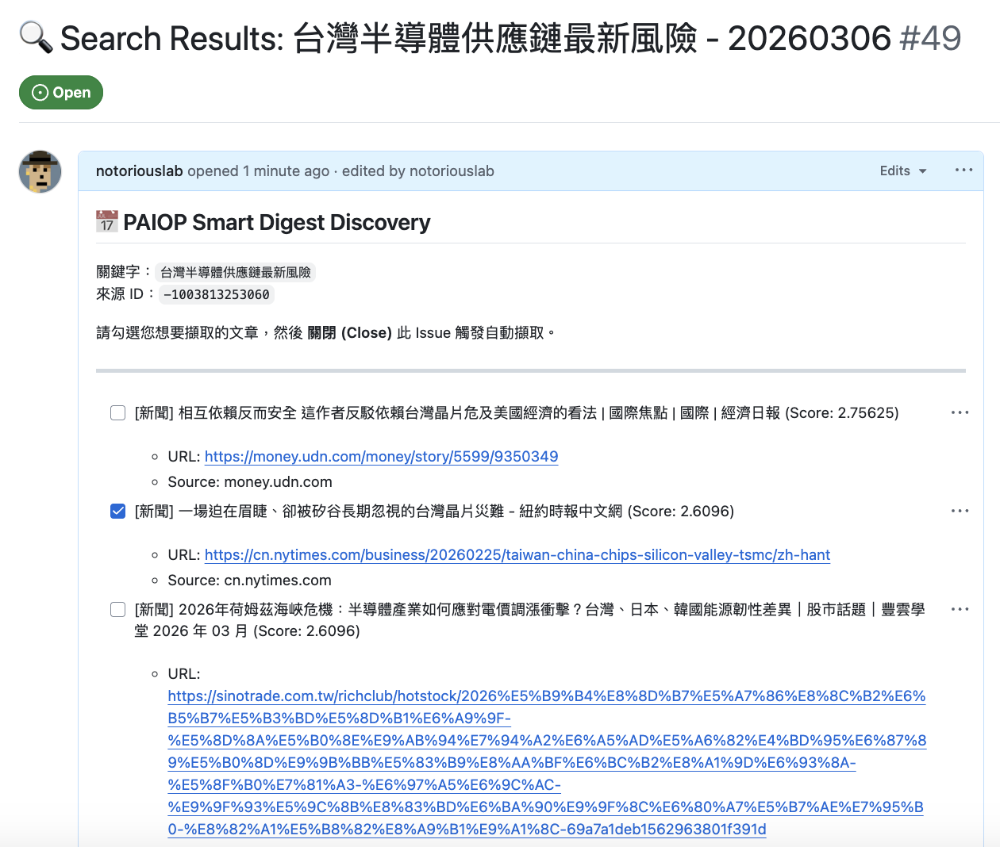
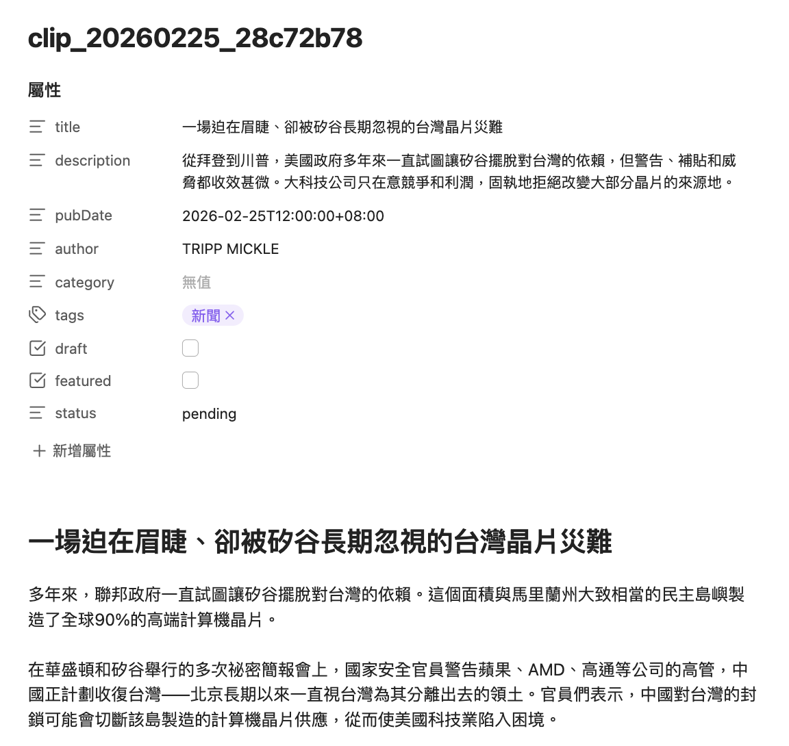
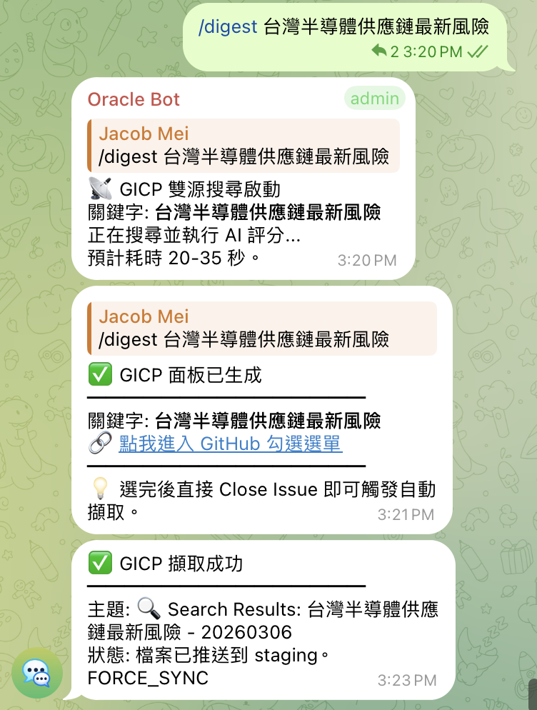

# GitHub 也能當 UI？用 IssueOps 建個人情報站

## 前言：我只是不想再自己刻前端

其實今天要分享的這個流程經驗，是懶出來的 :P

之前寫了一個小工具，可以每天去網路搜尋資料，再透過 AI 解析後透過 Telegram bot 傳給我，但有時候發現一些不錯的文章，想要收藏，還得另外再去處理，覺得很麻煩。

本來想讓 AI 再開發一個介面來幹這事，只要 Token 敢花，大概都能開發出一套不錯的機制，但環境有越來越複雜的傾象，最後傷神的都不是核心邏輯，而是那個「為了點幾下」搞出來的 UI，弄完才發現功能根本用不到幾次 XD

我在 GitHub 上翻了不少現成專案，但沒有一個剛好符合我的懶人需求：**大範圍搜尋 + AI 幫我先篩一遍 + 手動挑選幾篇，自動存擋就好** ，最後決定：**完全不寫前端，嘗試直接用 GitHub Issue 當操作介面** XD

這個做法有個專有名詞叫 **IssueOps** ，通常是拿來跑 CI/CD 自動化或部署審核的，也有人拿它當作 RSS 文章閱讀，我的用法比較特別，把它借來用在情報蒐集上，把「搜尋 → 挑選 → 存檔」全部包進 Issue 的開關、留言、Checkbox 這些動作裡。

**順手將這個 issueops-digest 做到 Github 上去了，連結在最下面 QA ～**

---

## 第一步：搜尋

我用的是免費的 Brave Search API 先抓 News 和 Web，避開廣告跟 SEO 垃圾文。後來又接了 [Tavily](https://tavily.com/) 做第二引擎，它有 `advanced` 深度搜尋模式，兩邊結果交替合併，確保不同來源都有公平採納，不會被某一邊洗版。

另外像 Substack、Medium 這類相對優質的長文平台，光看標題跟摘要根本判斷不了品質，所以我又接了也是免費的 [Jina Reader](https://r.jina.ai/) 自動抓全文 Markdown 回來，讓 LLM 是基於「文章深度」而不是「標題關鍵字」來打分。

抓回來不直接丟給我看，透過評分機制將相對重要的文章放前面，並且扣除重複率高或相類似出處的文章，這部分是用了公式 + Gemini 做篩選的權重模組：

- **直接 0 分**：網站首頁、導航頁、沒有實質內容的社論
    
- **高分**：有數據、有圖表、有具體分析的深度文章
    

這只是我的搭法，因為之前已經申請過 Brave Search API，想說不用白不用 ....

**搜尋來源在 Github 上有很多選擇，都很棒**：

- 用 [RSS-to-readme](https://github.com/gautamkrishnar/blog-post-workflow) 把 RSS 訂閱接進來再評分
    
- 用 [newspaper3k](https://github.com/codelucas/newspaper) 爬你信任的幾家媒體
    
- 直接拉 [Hacker News API](https://github.com/HackerNews/API) 的熱門討論
    

但讓權重模組先篩一遍，免得太多雜訊，這個實作才是重點。

另外我還做了三種評分模式可以切換：一般模式、新聞模式（時效分拉高）、研究模式（長青內容優先，2020 年的好文不會被 2026 年的股價波動掩埋）。跑的時候加個 `--profile=research` 就行，不用改程式。

---

## 第二步：要好選！

這是我最近最滿意的設計 XD

我在 Github 上開一個 private repo，然後讓系統「將每次搜尋結果自動在 private repo 開一個 Issue，把高分文章列成 Checkbox 清單，並透過 Telegram Bot 通知我可以去盤點了」。

這樣只要我手機打開 GitHub App，勾選每次搜群結果，將想保留的幾篇打勾，然後在 Issue 底下留個備註：

> 「最近小龍蝦開箱文太多，不用花太多時間啦」  
> 「Notebooklm 應用這篇挺好的，先記下來到 Obsidian 慢慢看」

勾完，關閉 Issue。GitHub Actions 偵測到關閉事件，後台自動執行抓文章並轉成 Markdown 格式，就變成個人資料庫了。

**為什麼不用 Telegram？**

很多人第一個問這個，其實我一開始也是在 Telegram Bot 收件，但是要選文章就真的很痛苦了，輸入編號選個五篇以上已經很崩潰，而且跳來跳去，很容易出錯。

GitHub Issue 的 Checkbox 批次勾，關閉一鍵搞定，體驗和爽度差很多。

但更大的差別是 **Issue 天生可以留備註**， 每次搜尋結果都是獨立一個 Issue，你隨手寫的想法永遠附在那次搜尋旁邊，三個月後回來找還在，Telegram 的聊天記錄根本做不到這件事。

加上是 private repo，搜尋關鍵字、URL 清單、你的備註也不會公開。

**為什麼不用 Discord？**

可能是之前玩 Web3 的 PTSD，我現在看到 Discord 就怕（笑），其實主要是因為我的關注議題沒有這麼多，Discord 對我來說維護時間成本太高，而且我比較喜歡用 Obsidian 來做資料整理的事。

---
## 理財資訊的實際用法

我之前也寫了一個簡單的分析工具，每天幫我看國際趨勢和大盤之類的，然後 Telegram Bot 一個彙整報告給我~

有時候會看到一些不錯的報告或是新聞想要蒐藏下來，這個小工具就可以派上用場了～

**實際跑一次看看——關注「台積電 戰爭 風險 | TSMC War」**

**查**：Brave 抓最新報導，Gemini 幫你篩掉社論和情緒標題，留下有財報數字的深度分析。三十篇進來，五到八篇值得看，AI 幫你先選好。

**選**：private Issue 列出清單，你勾選那篇 Bloomberg 的分析，在底下留個備註：

> 「長期持股參考，重點看通脹數據那段」  
> 「這篇偏多頭，找篇空頭的一起看」

關閉 Issue，後台自動處理。

---
## 結語

IssueOps 原本是工程圈跑自動化流程的技術，搬過來用之後，GitHub Issue 從「通知存檔區」變成了「動態控制面板」。

> 本質上這是一個單人工具。搜尋品質完全依賴 Brave + Tavily 的結果再讓 Gemini 打分，但 Gemini 的 prompt 是固定的、評分標準是自己定的，各位若拿去用，可以自己修改 config.yaml 等相關邏輯（fuzzy filter 的規則、分數門檻 1.1、權重公式），主要是想透過 GitHub Issues + Actions 這個組合解決「不想養伺服器又想有 UI」的問題 XD

這套最讓我滿意的一點是：**整個設計站在 GitHub 這個巨人的肩膀上** ，免費、穩定、全平台、有官方 App，這些都不用自己搞，哈哈

厭倦在搜尋結果裡翻頁的朋友，試試這個方向吧。

## 常見 Q and A

**Q：這套東西有程式碼可以參考嗎？**

**A :** 我整理了一個簡單的版本，已經放在 Github 上，叫做 [issueops-digest](https://github.com/notoriouslab/issueops-digest/ "Github issueops-digest") , 有興趣的夥伴可以上去看看，程式碼很簡單，我覺得比較有意思的是這個思維脈絡，若是可以給我星星鼓勵一下更好 XD

**Q：這套東西維護起來麻煩嗎？**

**A :** 說真的不麻煩，沒有前端伺服器要顧、沒有月費、資料也不會被鎖在別人的平台。搜尋紀錄、勾選記錄、備註全存在 Issue 裡，換一台電腦 `git clone` 一下，整套就活了，而且所有的動作包括 Issue 關閉後，GitHub Actions 自動解析勾選的 URL，抓內容、清洗廣告，存進知識庫，這些以後都有紀錄可查。

透過 手機就可以完全達到在外搜尋、挑選和備份到 Obsidian 文件的所有事情。

**Q：AI 在裡面主要做什麼？**

**A：** AI 負責第一道過濾，幫你把 50 篇縮成 10 篇值得看的。LLM 評完分之後，還有一層關鍵字模糊匹配（支援中英雙語、不看順序），沒命中的文章會被大幅降權，兩關篩下來品質蠻穩的。AI 很擅長解析 Markdown 和操作 GitHub API，你也可以讓它自動幫你預選、或根據你過去的勾選習慣猜你想看什麼。

**Q：環境要求高嗎？**

**A :** 完全不會，這套走的是動態路徑、環境變數管理，沒有任何硬編碼，這也是 PAIOP 的跨機標準，我目前就是裝在 Oracle Free Cloud 上，設定好 GitHub token 就直接跑，很輕量。