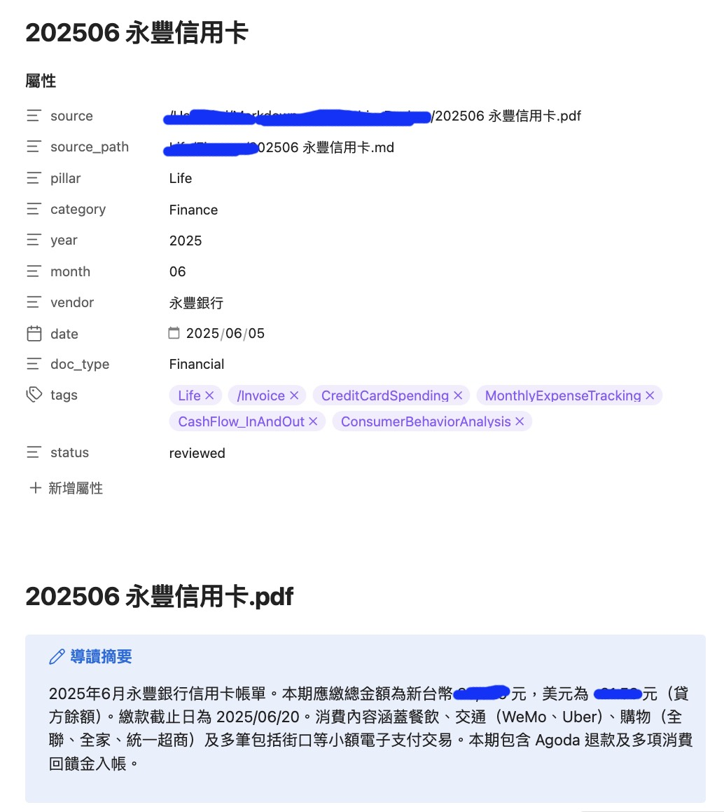
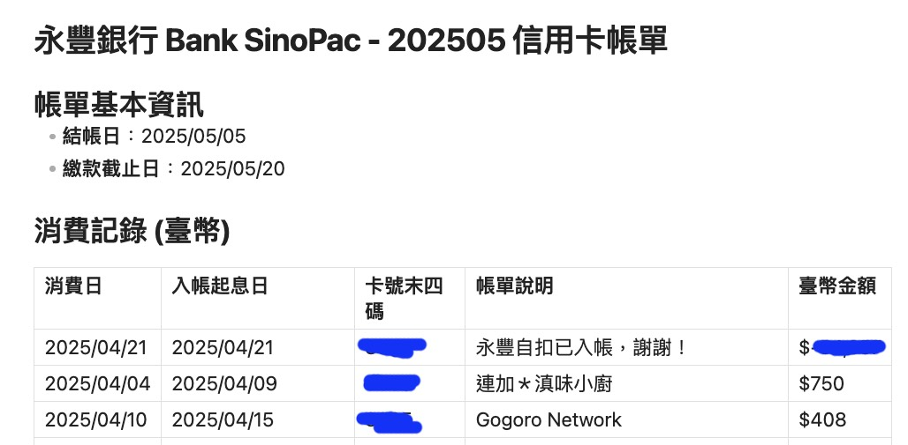

# 文件整理超費神，然後越來越龐雜 XD

每個月的信用卡對帳單、保險通知、投資報告書，這些 PDF、DOCX、Excel 檔案躺在你的硬碟或信箱裡，格式五花八門，有的是純文字，有的是掃描圖片，有的還加了密碼。你想把它們整理成統一格式方便查閱，但市面上的工具不是要你上傳到雲端，就是轉出來的結果表格全部消失，喔對，還有中文變成亂碼 XD

所以我為了自己方便，搞了 doc-cleaner。

---

## 三部曲，但你只需要其中一部

doc-cleaner 是 [notoriouslab](https://github.com/notoriouslab) 開源工具組「個人財務自動化三部曲」的第二部：

```
第一部：gmail-statement-fetcher  ─  從 Gmail 自動下載對帳單 PDF,Zip，且解密
第二部：doc-cleaner              ─  把文件轉成乾淨的 Markdown 文件
第三部：personal-cfo             ─  月度財務審計 + 退休規劃
```

三個工具串在一起，可以自動完成「下載 → 轉檔 → 分析」的完整流程。但每一部都是獨立的，你不需要在 Gmail 下載文件，也不需要做財務分析，單獨拿 doc-cleaner 來整理手邊的文件也很好。

只要一行指令：

```bash
python cleaner.py --input 你的對帳單.pdf
```

輸出的 Markdown 檔案，可以直接用 Obsidian、Notion、HackMD 或任何文字編輯器打開。

如果你在用 [OpenClaw](https://openclaw.ai/) 或其他 AI Agent 框架，doc-cleaner 附帶了標準的 `SKILL.md` ，最下面有安裝指南。

要是都懶得想，也可以讓 AI Agent 幫你安裝 XD

---

## 和其他工具有什麼不同？

市面上把文件轉成 Markdown 的工具不少，Pandoc、Marker、Docling 都算，Github 上也很多打包好的專案可以用，doc-cleaner 的出發點不太一樣，它不是通用格式轉換器，比較像是專門為繁體中文文件設計的清洗器，然後因為我個人需要，所以我補了一些金融文件的清洗規則。

### 1. 繁體中文的編碼問題，一次搞定

大部分工具預設英文世界的編碼邏輯。遇到台灣的金融機構寄來的 Big5 編碼 CSV、或保險公司的 CP950 PDF，不是亂碼就是直接報錯。

doc-cleaner 自動偵測 UTF-8、Big5、CP950、UTF-16 四種編碼，不用特別指定。

### 2. 表格不會消失

很多轉檔工具碰到表格就降階處理，要嘛整張表不見，要嘛變成一堆文字擠在一起。

doc-cleaner 的做法：

- Word 文件：逐一解析每張表格，轉成標準的 Markdown pipe table
- Excel / CSV：每個工作表獨立處理，空格補齊，完整保留
- PDF：如果 AI 模式開啟，會特別指示 AI「已經是表格的，原封不動」

所以表格當中的的交易明細、資產配置表、損益表，不會在轉檔過程中走樣（儘量，但文件格式實在太多，我盡力了）。




### 3. PDF 不是都一樣的

一般工具拿到 PDF 就一視同仁地處理，這次編寫程式的過程中，為了想省點資源，儘量不用 AI 處理，我基本上將 PDF 分三種：

| 類型   | 常見來源     | 處理難度         |
| ---- | -------- | ------------ |
| 原生文字 | 大部分文件    | 低，直接提取       |
| 格式破碎 | 表格被壓扁的報表 | 中，需要 AI 重建   |
| 掃描圖片 | 紙本掃描的收據  | 高，需要 AI 看圖辨識 |

doc-cleaner 會先判斷 PDF 屬於哪一種，再決定處理策略。原生文字的直接提取，不浪費 AI 額度；只有真正需要的才送 AI，除了省錢，不用送雲端的文件就盡量不要送。

### 4. 可以完全離線

這是跟大多數同類工具最大的差異。三種模式：

- `--ai none`：不需要 API、不需要網路，純粹提取文字和表格。Mac、Linux、ARM 伺服器都能跑，但複雜的表格或文件就沒辦法搞得很漂亮
- `--ai ollama`：用你電腦上的本地 AI 模型處理，文件不離開你的電腦，但電腦本身要更夠力一點，我目前用 iMac 2019 堪用，但會跑比較久，我就通常讓它半夜慢慢做文件清洗
- `--ai gemini`：用 Google Gemini，效果最好，適合不敏感的文件，但其實我已經不太在意敏不敏感了，哈哈

### 5. 幫你去掉廢話

台灣的金融機構文件 PDF，尾巴幾乎都帶著一大段「投資人權益通知」、「謹慎理財，信用至上」之類的法律聲明，每份對帳單都一模一樣，但佔了不少篇幅，分析或保存其實不需要。

doc-cleaner 內建了常用的一些截斷規則，自動把這些重複的聲明移除，但因為金融機構的文件格式太多，也可能一段時間就換一些說明內容，很難做的很好，你可以在設定檔裡加入自己銀行的規則。安全機制也有，如果截斷會移除超過 70% 的內容，程式會跳過，避免誤殺正文。

---

## 給 AI Agent 玩家：支援 小龍蝦 OpenClaw 一鍵整合

如果你在用 [OpenClaw](https://openclaw.ai/) 或其他 AI Agent 框架，doc-cleaner 附帶了標準的 `SKILL.md` 檔，你的 Agent 可以直接透過 shell 呼叫它，搭配 `--summary` 取得 JSON 格式的處理結果，不需要額外封裝。

```bash
# Agent 呼叫範例：處理文件 + 取得機器可讀的結果
python cleaner.py --input document.pdf --ai none --summary
```

回傳的 JSON 長這樣：

```json
{
  "version": "1.0.1",
  "total": 1,
  "success": 1,
  "failed": 0,
  "files": [{"file": "document.pdf", "output": "./output/document.md", "status": "ok"}]
}
```

Agent 可以用 exit code 判斷成敗（0 = 全部成功、1 = 部分失敗、2 = 設定錯誤），再搭配 JSON 取得每個檔案的細節。只要能跑 shell 指令的 Agent 框架都能整合。

---

## 誰適合用？

> 想整理各種亂七八糟文件的人，想處理金融機構對帳單或報表的人，每月對帳單都可以自動轉成 Markdown，方便搜尋和回顧。
> 
> Obsidian 或其他 PKM 使用者，把各種文件匯入知識庫統一格式。
> 
> 重視隱私的人，離線模式或本地 AI，敏感文件不必上雲。
> 
> 開發者和 AI 玩家，標準 CLI 介面，可串接任何自動化流程。

---

## 開始使用

```bash
git clone https://github.com/notoriouslab/doc-cleaner.git
cd doc-cleaner
pip install -r requirements.txt
python cleaner.py --input 你的文件.pdf --ai none
```

不需要註冊帳號，不需要 API key，不需要上傳任何東西。

想要更好的效果，加上 AI：

```bash
# 方法一：本地 AI（隱私最高）
pip install ollama
python cleaner.py --input 你的文件.pdf --ai ollama

# 方法二：雲端 AI（效果最好）
pip install google-genai python-dotenv
echo 'GEMINI_API_KEY=你的金鑰' >> .env
python cleaner.py --input 你的文件.pdf --ai gemini
```

完整說明請見 [GitHub 專案頁面](https://github.com/notoriouslab/doc-cleaner)。

---

## 常見問題 Q&A

**Q：我不會寫程式，能用嗎？**
可以。安裝好 Python 之後，只需要在終端機打一行指令。如果你用 OpenClaw 之類的 AI 助手，連指令都不用自己打，直接告訴 AI「幫我用這個酷東西」就好 XD

**Q：和 Pandoc 有什麼不同？**
Pandoc 是通用格式轉換工具，強項是 Word、LaTeX、HTML 之間的互轉。但它不會幫你去掉廣告、不會判斷 PDF 是掃描的還是原生的、碰到 Big5 編碼也需要你自己指定。doc-cleaner 專注在把亂七八糟的文件清洗成乾淨的 Markdown，特別針對繁體中文金融文件做了優化。

**Q：和 Marker、Docling 比呢？**
Marker 和 Docling 在 PDF 轉換上做得很好，但它們偏向學術論文和英文文件。doc-cleaner 的優勢在於繁體中文編碼支援、可完全離線運行，以及內建的金融文件廣告截斷。如果你的文件是英文學術論文，Marker 可能更適合；如果是台灣的金融機構對帳單，doc-cleaner 執得試試。

**Q：我的文件很機密，安全嗎？**
用 `--ai none` 模式，所有處理都在你的電腦上完成，不會有任何網路請求。用 `--ai ollama` 模式，AI 推理也是在本機跑。只有 `--ai gemini` 會把文件內容送到 Google 的伺服器。你可以根據文件的敏感程度選擇模式。

**Q：支援哪些檔案格式？**
PDF（原生文字、掃描圖片、加密）、DOCX、XLSX / XLS / CSV、TXT、Markdown。基本上你信箱或硬碟裡會有的文件格式都涵蓋了。

**Q：PDF 加了密碼怎麼辦？**
安裝 `pikepdf` 套件後，用 `--password` 參數傳入密碼即可。密碼也可以放在 `.env` 檔案裡，避免每次都要輸入。

**Q：AI 模式要花錢嗎？**
Ollama 完全免費，跑在你自己的電腦上。Gemini 有免費額度，一般個人使用不太會超過。用 `--ai none` 就完全不需要 AI，零成本。

**Q：可以處理整個資料夾嗎？**
可以。把 `--input` 指向一個資料夾，doc-cleaner 會自動處理裡面所有支援的檔案。目前不會進入子資料夾，刻意的設計，避免意外處理不該碰的檔案。

**Q：輸出的 Markdown 可以用在哪裡？**
任何支援 Markdown 的工具都行：Obsidian、Notion（匯入）、HackMD、Logseq、VS Code，甚至直接用 GitHub 瀏覽。輸出檔案會附帶 YAML frontmatter（標題、日期、標籤），方便知識管理系統索引。

---

## 開源，MIT 授權

doc-cleaner 是完全開源的自由軟體，採用 MIT 授權。你可以自由使用、修改、商用。

原始碼在 [GitHub](https://github.com/notoriouslab/doc-cleaner)。如果你的銀行有特殊的廣告格式，歡迎幫忙新增截斷規則，一行正則表達式就好。

<font color="#ff0000">然後，可以的話給我一顆星星鼓勵我 :P</font>
