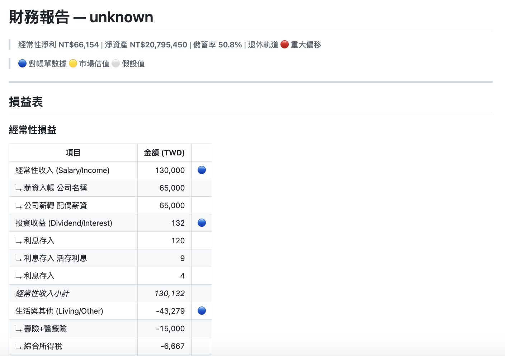

# 知道自己的退休計畫在軌道上嗎？

大多數人（包括我）沒有毅力做財務規劃。我們靠社群、新聞標題和 LINE 群組的股票明牌做決策，偶爾看一下銀行 APP 的餘額，覺得還有錢就繼續過日子。

問題是，「覺得還有錢」和「真的在軌道上」是兩回事。

每個月薪水進來、房貸扣掉、信用卡繳掉、保險扣掉，到底這個月是賺還是賠？股票佔你總資產的比例，跟你這個年紀應該承受的風險一致嗎？這些東西不是很難算，但就是沒恆心處理，然後每天被社群新聞搞崩心態 :P

所以我懶人思維又啟動了，決定讓 Python 幫我算（客觀？）。

---

## 懶人理財三部曲，完結篇

personal-cfo 是 [notoriouslab](https://github.com/notoriouslab) 開源工具組「個人財務自動化三部曲」的最後一部：

    第一部：gmail-statement-fetcher  ─  從 Gmail 自動下載對帳單 PDF
    第二部：doc-cleaner              ─  把文件轉成乾淨的 Markdown
    第三部：personal-cfo             ─  月度財務審計 + 退休滑翔路徑 + 退休投影

三個工具串在一起：每個月 Gmail 收到對帳單，自動下載、自動轉檔、自動算出損益表和退休軌道。但跟前兩部一樣，每一部都是獨立的，你不需要用前面兩個工具，手上有 CSV 或 Markdown 表格就能直接跑。

只要一行指令：

    python -m personal_cfo cfo --transactions ./帳單/ --period 2026-02 --offline

輸出完整的月度財務報告。

---

## 不是又一個記帳 APP

市面上記帳 APP 工具多到爆，從 Excel 模板到 SaaS 應用都有，從 MOZE 到 MoneyForward。personal-cfo 做的事情不太一樣：

**它不記帳。它審計。**

不需要每天手動輸入「午餐 150 元」、「計程車 280 元」，那種事情信用卡帳單、電子支付的紀錄等都已經幫你記了。personal-cfo 拿你上個月的銀行帳單，事後算一次總帳，告訴你：

- 這個月淨賺還是淨賠
- 錢花到哪些大類（生活、房貸、保險、投資）
- 你的資產配置跟退休計畫是不是偏了

重點是「確定性運算」：我全部都會用 Python 算數字，不讓 AI 假設性的猜數字拆解，沒有幻覺，沒有「我覺得你這個月花太多」的 AI 情緒價值，偏了就告訴你偏了，在軌道上就安安靜靜。當然假如你都還是現金用的比較多，這個工具就只能從銀行帳戶提領多少錢來判斷，無法通靈幫你推估，但假如銀行對帳單都有給它拆解，那麼其實大概率來說也可以當參考了。

---

## 它算什麼？

丟進去銀行對帳單、信用卡對帳單、證券對帳單等金融機構資料，或是你自己的記帳文件（CSV 或 Markdown），它可以產出五份東西：

### 1. 損益表（8 大類）

不是那種「食衣住行育樂」的分法，是按照資金性質分的：

| 類別    | 舉例                                     |
| ----- | -------------------------------------- |
| 經常性收入 | 薪水、副業收入                                |
| 投資收益  | 股息、利息、租金                               |
| 生活支出  | 吃飯、購物、保險 再次強調，現金只能透過銀行對帳單的提領金額總體來試算 |
| 房貸本金  | 還本（不是利息）                               |
| 房貸利息  | 利息（不是還本）                               |
| 摩擦成本  | 手續費                                    |
| 資本支出  | 定期定額投資                                 |
| 資本轉移  | 基金申購贖回（錢還在你的帳戶裡，只是換個形式）                |

為什麼要區分房貸本金和利息？因為還本金其實是在增加你的淨資產，但利息是真的花掉了。為什麼資本轉移不算支出？因為你買了 ETF，錢沒有消失，只是從銀行跑到券商。

這些區分聽起來囉嗦，但算出來的「經常性淨利」才是你真正的財務狀況指標。

### 2. 資產負債表

從銀行存款、證券庫存、不動產，到房貸負債，按風險分桶：

- 流動資產（現金）
- 股票 / ETF
- 債券 / 結構型商品
- 不動產
- 保險價值
- 負債

### 3. 現金流量

扣掉資本轉移（不是真的花錢）後的實際現金進出。

### 4. 市場定錨

美國十年期殖利率、比特幣、黃金、台幣匯率、加權指數 — 不是要你看盤，是給你一個「現在全球大概什麼狀態」的背景參考。

### 5. 退休滑翔路徑

這是整個工具的核心。

概念很簡單：年輕的時候可以承受高風險（多放股票），越接近退休越該保守（多放債券和現金）。這條「隨年齡遞減的目標股票比例」就是 glide path，滑翔路徑。

你設定「我現在覺得 60% 股票比例合適」（經典 60/40 配置），程式每年自動降 1%。然後每個月跑一次，看你實際的股票佔比跟目標差多少：

- 差距 3% 以內：在軌道上，安靜
- 差距 3-5%：輕微偏移，下次再平衡留意一下
- 差距超過 5%：重大偏移，該調整了

就這樣，不會每天煩你，不會叫你進出，只在每月結算偏掉的時候提醒你。

### 6. 退休投影（project 指令）

上面五個是「完全基於事實，看過去」— 你上個月的帳怎麼樣。

退休投影是「一堆不確定假設，看未來」— 你的錢夠不夠撐到老 XD

它拿你實際的資產快照，加上你設定的假設（通膨、報酬率、預期壽命、每月年金），逐年推算到預期壽命。產出一張表告訴你：

- 幾歲的時候流動資產會歸零？（資金枯竭年齡）
- 按照 4% Rule / 3.5% Rule，你退休時需要多少流動資產？
- 如果有勞保年金，缺口會縮多少？

重點：退休投影只算「可提領的流動資產」— 現金、股票、債券、保險。這跟你在銀行 APP 看到的「總資產好像很多」是完全不同的角度。

指令一樣簡單：

    python -m personal_cfo project --snapshot ./output/snapshots/2026-01_asset_snapshot.json

所有假設都標示得清楚，這裡全部都是假設值，你可以自己調參數試試看「如果通膨高一點」、「如果多存一點」會怎樣。再次前調這不是預測，是讓你知道「原來這些參數這麼敏感」。

---

## 每個人的財務狀況不一樣

這是個 **framework**，不是開箱即用的 APP。

每個人的分類規則都不一樣（你的薪水入帳描述肯定跟我的也不同），你的退休年齡跟我的不一樣，你的風險承受度跟我的不一樣，所以你需要依照自己的需求改 `config.yaml`。

聽起來很麻煩？其實就是一個 YAML 檔案，填幾個數字：

    life_plan:
      birth_year: 1984          # 你幾年出生
      retirement_age: 63        # 打算幾歲退休

    glide_path:
      equity_target: 0.60       # 你現在覺得合適的股票比（經典 60/40）
      annual_derisking: 0.01    # 每年降 1%

    category_rules:
      "薪資": salary            # 你的銀行帳單上薪水的描述
      "房貸": housing           # 你的銀行帳單上房貸的描述

不知道怎麼設定？`examples/` 目錄裡，我先提供了三種情境的範本：

| 範本 | 情境 |
|------|------|
| `config_young_professional.yaml` | 30 歲單身，高股票比，簡單分類 |
| `config_mid_career_family.yaml` | 42 歲雙薪家庭，有房貸有保險 |
| `config_pre_retirement.yaml` | 56 歲接近退休，防禦性配置 |

或者，直接丟給 Claude / ChatGPT 等 AI，跟它說「我的狀況是 XXX，幫我改這個 config」，AI 最擅長這種填表格的事 XD

---

## 它怎麼吃你的帳單？

三種格式都吃：

**CSV** — 最通用，自己整理或從網銀匯出整理的都行：

    date,description,amount,currency,category
    2026-01-05,薪資,45000,TWD,salary
    2026-01-10,房貸,-25000,TWD,housing

**doc-cleaner 的 Markdown** — 如果你用了三部曲的第二部，它的輸出可以直接餵進來，不需要任何額外處理。就算 AI 生成的 JSON 不完整，parser 也會自動從 Markdown 表格補漏。

**純 Markdown 表格** — 自己手寫的也行：

    | 日期 | 摘要 | 支出 | 存入 |
    |------|------|------|------|
    | 2026/01/05 | 薪資 | | 45,000 |
    | 2026/01/10 | 房貸 | 25,000 | |

Parser 會自動辨識欄位名稱（日期、摘要、金額、支出、存入），不需要特殊格式。

而且 `examples/` 裡有三份虛構的小康家庭帳單（銀行、信用卡、證券），你可以直接跑跑看，不需要用自己的真實資料就能體驗完整流程。

---

## 給 AI Agent 玩家

跟前兩部一樣，personal-cfo 附帶了標準的 `SKILL.md`，你的 Agent 可以直接透過 shell 呼叫它：

    python -m personal_cfo cfo \
      --transactions ./statements/ \
      --period 2026-02 \
      --offline --quiet

`--quiet` 模式只寫檔不輸出，適合自動化流程。報告和資產快照（JSON）都會存到指定目錄，Agent 可以接著跑退休投影：

    python -m personal_cfo project \
      --snapshot ./output/snapshots/2026-02_asset_snapshot.json \
      --quiet

如果你在用 [OpenClaw](https://openclaw.ai/) 或其他 AI Agent 框架，一鍵整合。

---

## 隱私和安全

所有運算都在你的電腦上完成。沒有雲端，沒有資料庫，沒有帳號。

唯一可能的網路請求是 yfinance 抓市場指標（美股、匯率、黃金），但你可以用 `--offline` 完全跳過，它會用快取或硬編碼的 fallback 值（會提醒你數據可能過時）。

你的 `config.yaml`（包含分類規則）在 `.gitignore` 裡，不會被意外提交到 Git。

---

## 誰適合用？

> 懶得記帳但想知道自己財務狀況的人 — 每月跑一次，5 分鐘看完報告。
>
> 有在做退休規劃但沒有工具追蹤的人 — glide path 幫你守住軌道。
>
> 用 Obsidian 或其他 PKM 的人 — 報告是 Markdown，直接丟進知識庫。
>
> 開發者和 AI 玩家 — CLI 介面，可串接任何自動化流程。

---

## 開始使用

    git clone https://github.com/notoriouslab/personal-cfo.git
    cd personal-cfo
    pip install -r requirements.txt
    cp config.example.yaml config.yaml

    # 用範例資料試跑
    python -m personal_cfo cfo \
      --transactions ./examples/sample_transactions.csv \
      --assets ./examples/sample_assets.csv \
      --period 2026-01 --offline

不需要註冊帳號，不需要 API key，不需要上傳任何東西，核心只依賴 `pyyaml`，連 pandas 都不需要。

想要即時市場數據：

    pip install yfinance
    # 去掉 --offline 就會自動抓

完整說明請見 [GitHub 專案頁面](https://github.com/notoriouslab/personal-cfo)。

---

## 常見問題 Q&A

**Q：我不會寫程式，能用嗎？**

可以，但開始的學習曲線會比較高。安裝好 Python 之後，只需要在終端機打一行指令。`config.yaml` 的設定可以請 AI 助手幫你填（真的，這種事 AI 做得比你快又好，不用擔心）。

**Q：和記帳 APP（MOZE、MoneyForward）有什麼不同？**

記帳 APP 要你每天手動輸入或綁定銀行 API，或是要填帳密資料授權。personal-cfo 不記帳，它拿你的月結帳單做事後審計，算的是「上個月你的整體財務健康度」而不是「你今天午餐花了多少」。兩者互補，不衝突。

**Q：和 hledger / beancount 這類 plain text accounting 工具比呢？**

hledger 和 beancount 是專業且完整的複式記帳系統，功能強大但學習曲線超高。personal-cfo 不做複式記帳，它專注在兩件事：月度損益審計和退休軌道監控。如果你已經在用 hledger，personal-cfo 的 glide path 概念可以補充你還沒有的退休追蹤功能。

**Q：退休滑翔路徑的概念是你發明的嗎？**

當然不是 XD，glide path 是 target-date fund（目標日期基金）的標準做法，Vanguard、Fidelity 都在用，personal-cfo 只是把這個概念變成一個很簡單，你可以自己跑的 CLI 工具，用你自己的數據。

**Q：我的帳單格式 personal-cfo 看不懂怎麼辦？**

Parser 是靠欄位名稱辨識的（日期、摘要、金額、支出、存入），大部分台灣的銀行對帳單格式都能處理。如果你的銀行比較特別，最簡單的方法是用 doc-cleaner 先轉一次，或者自己整理成 CSV，不然就是同樣扔給 AI，讓他幫你爬梳結構也很快。

**Q：多幣別怎麼處理？**

在 `config.yaml` 設定靜態匯率（例如 `USD_TWD: 32.0`）。如果安裝了 yfinance 且不是離線模式，也會嘗試抓即時匯率。

**Q：退休投影準嗎？**

完全不準！而且工具會明確告訴你「這是假設，不是預測」。
它的價值不是給你一個精確數字，而是讓你知道「通膨多 0.5% 會差多少」、「有沒有勞保年金差多少」。自己動手調幾個參數，你會比看任何理財文章都更有感覺。

**Q：資料安全嗎？**

所有運算都在本機。唯一的網路請求是 yfinance 抓公開市場數據（可用 `--offline` 關掉），你的帳單資料不會離開你的電腦。

## 特別感謝

這篇文章最後要特別感謝 [李柏鋒](https://www.facebook.com/firefly88)，有些不確定的財務公式有請教他，我之前定期定額投資的習慣也是受他影響。

---

## 開源，MIT 授權

personal-cfo 是完全開源的自由軟體，採用 MIT 授權。歡迎自由使用、修改、商用。

原始碼在 [GitHub](https://github.com/notoriouslab/personal-cfo)。如果你有特別的使用情境或分類規則，歡迎貢獻。

然後，可以的話，請在 Github 給我一顆星星鼓勵我 :P
