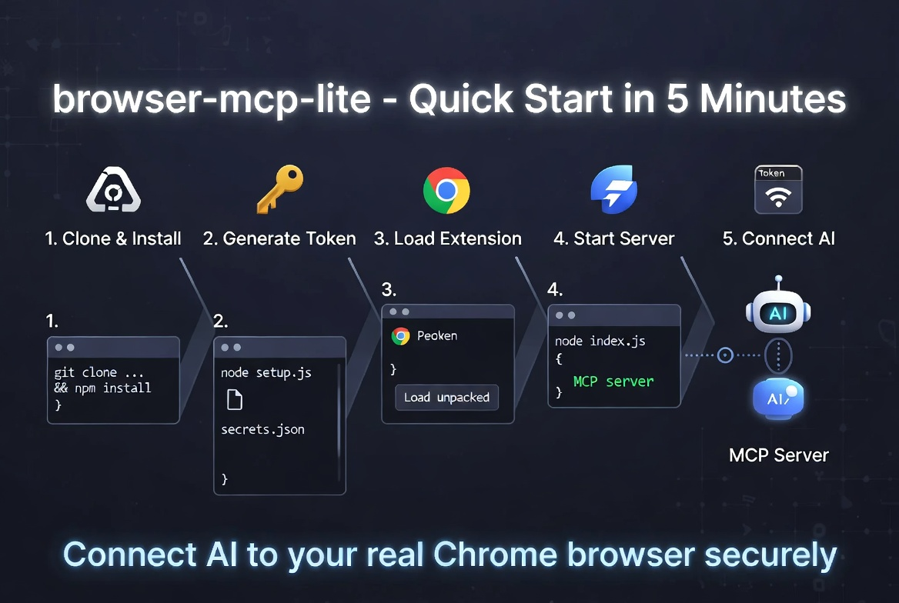

# browser-mcp-lite 開源：讓 AI 助手直接看見你真實的 Chrome 瀏覽器

之前開源了[個人理財專案 Personal-CFO](https://jacobmei.com/blog/2026/0315-57xyy6/)，當時的規劃是「不需要每天手動輸入午餐 150 元、計程車 280 元這類瑣事，personal-cfo 拿你上個月的銀行帳單幫你分析」。

不過這陣子一直有人在問，可不可以即時的取得相關資料，所以我就做了另一套極簡版的 MCP 伺服器，可以透過瀏覽器來操作網站。**browser-mcp-lite** 只用了大概 500 行程式碼，就能讓 Claude、Cursor 等 AI agent 能直接讀取你**已經登入**的 Chrome 分頁、截圖、執行 JS，同時保留所有 Cookie 和登入狀態。

不用 headless 瀏覽器、不用把頁面丟到雲端，也不用開過多的危險權限，如果你也有類似的需求，需要讓 AI 幫你操作網頁（尤其是已登入的內部系統、Gmail、Notion 之類），這個專案應該會蠻有用的。

## 現有方案沒有適合的嗎？

Github 上類似的專案不少，就連 [Claude 之前都推出了 Computer Use](https://platform.claude.com/docs/en/agents-and-tools/tool-use/computer-use-tool)，我試過幾個瀏覽器 MCP 工具，結果都不是很合用：

- 有些開了 debugger、history、`<all_urls>` 等非常多權限，程式碼又是 minified 的。
- 有些是開 headless 瀏覽器，無法看到自己已經登入的帳號和頁面。
- 有些直接把瀏覽器頁面送到第三方雲端服務解析，隱私也有疑慮。

所以研究了一輪後，決定自己動手做一個：**輕量、可審計、最小權限、可操作真實瀏覽器的工具**。

來個簡單對比：

| 比較項目         | mcp-chrome       | Playwright MCP  | **browser-mcp-lite** |
| ------------ | ---------------- | --------------- | -------------------- |
| 操作真實瀏覽器      | 是                | 否（headless）     | **是**                |
| MCP 端點有認證    | 否                | 否               | **有 Token 認證**       |
| Extension 權限 | 8 種以上            | N/A             | **僅 5 種（最小）**        |
| 程式碼可審計性      | Minified         | 是               | **約 500 行，清楚好讀**     |
| 保留登入狀態       | 是                | 否               | **是**                |
| 每次讀頁面的 token | 2-5KB ~幾百 tokens | HTML ~數萬 tokens | 2-5KB ~幾百 tokens     |

## 基本的四個實用功能

目前內建四個實用功能，夠我自己平常使用：

- `list_tabs`：列出所有開啟的分頁（ID、URL、標題、是否活躍）
- `read_page`：讀取頁面的 Accessibility Tree，轉成結構化文字（超省 Token）
- `screenshot`：截取目前可見區域，回傳 Base64 PNG
- `inject_script`：在指定分頁執行自訂 JavaScript，並拿回傳值

其中 `read_page` 採用 accessibility tree，把原本可能 100KB+ 的 HTML 壓到幾 KB，這樣 AI 看起來又快又省。

## 快速簡單好上手

### 1. Clone 專案

```bash
git clone https://github.com/notoriouslab/browser-mcp-lite.git
cd browser-mcp-lite/server
npm install
```

### 2. 產生 Token

```bash
node setup.js
```

它會在 `~/.browser-mcp-secrets.json` 建立一個隨機 64 字元的 Token，權限也自動設成只有你能讀寫。

### 3. 載入 Chrome Extension

- 打開 `chrome://extensions/`
- 開啟「開發人員模式」
- 點「載入未封裝項目」，選 `extension/` 資料夾
- 點工具列的 Browser MCP Lite 圖示，貼上 Token 後點 Connect

### 4. 啟動伺服器

```bash
node index.js
```

看到<font color="#00b050">綠燈亮起</font>就代表連線成功了。

### 5. 連到 AI 助手

在 Claude Desktop、Claude Code 或 Cursor 之類的工具裡的 MCP 設定裡，加上：

```json
{
  "mcpServers": {
    "browser": {
      "type": "http",
      "url": "http://127.0.0.1:12307/mcp",
      "headers": {
        "Authorization": "Bearer 你的TOKEN"
      }
    }
  }
}
```

換上你的 Token 就好。

這一段若不太確定怎麼做，可以讓 AI 幫你安裝～



## 為什麼用 Accessibility Tree？

一般網頁 HTML 動輒 50-200KB，但轉成 Accessibility Tree 後通常只剩 2-10KB，**小了 10~50 倍**。

它會去掉一大堆樣式、腳本和裝飾性元素，只留下真正重要的標題、連結、按鈕和它們的關係，讓 AI 更容易理解頁面結構。

## 安全設計

- 雙層 Token 認證（HTTP + WebSocket）
- 只申請 `tabs`、`activeTab`、`scripting`、`alarms`、`storage` 五種權限
- 伺服器只綁 `127.0.0.1`，完全不對外開放
- Extension 不會用你的 Cookie 發任何網路請求
- 用完直接 Ctrl+C 關掉，沒有常駐 daemon

**隱私提醒**：  
`list_tabs` 會讓 AI 看到所有分頁的 URL 和標題，`screenshot` 會截取畫面，`inject_script` 也有 Prompt Injection 的風險。建議啟動前先關掉敏感分頁，並且不要開自動核准工具呼叫。

我看了一下類似的工具，權限大多開的比 **browser-mcp-lite** 更多，這部分實在想不到更好的做法，還是要先讓大家知道這類工具的風險。

## 幾個實作心得

1. Manifest V3 的 Service Worker 很容易被 Chrome 殺掉，用 `chrome.alarms` 每 24 秒 ping 一下比較能穩住。
2. Accessibility Tree 真的比 raw HTML 好太多，以後寫這類工具都要優先考慮這個方向。
3. Token 認證雖然簡單，但對本機工具來說足夠安全又方便。
4. 整理網站的時候，遇到了很多解析的問題，所以我在 examples 裡放了我自己覺得很有用的示範案例，**分別對應三種金融機構網頁常見的架構 ：伺服器渲染 + AJAX、React / Angular SPA、iframe 架構的老系統，細品 XD**
## 專案資訊

- GitHub：https://github.com/notoriouslab/browser-mcp-lite
- 授權：MIT
- 需求：Node.js 18+、Chrome/Chromium

如果你也在找讓 AI 安全又方便操作真實瀏覽器的方案，歡迎試用看看！

有問題、想新增工具、或有更好的想法，都歡迎在 GitHub 開 Issue，或直接 PR。

如果這個專案對你有幫助，可以的話也<font color="#ff0000">幫我在 GitHub 上點個星星</font>吧 :P
