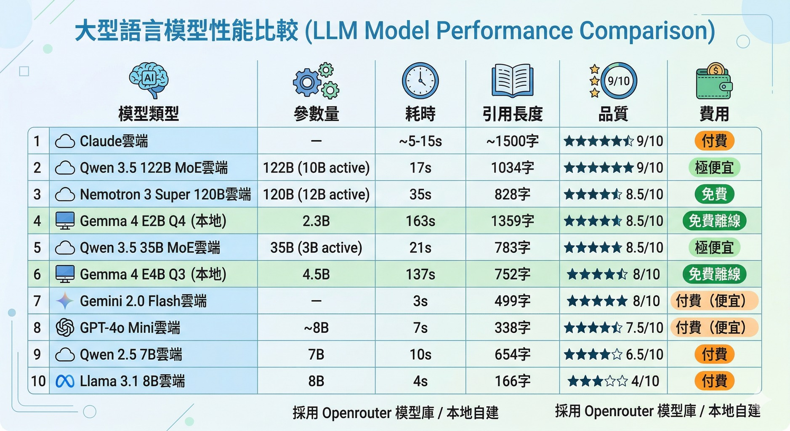

# Gemma 4 在 8GB MacBook Air 上的 RAG 實測

Google 在 2026/04/02 發佈了 Gemma 4 開源模型家族，首次採用 Apache 2.0 授權。之前在 M2 MacBook Air（8GB）上跑本地模型，基本上沒什麼實用性——這次 Gemma 4 讓我第一次覺得「8GB 的機器真的能跑有用的地端模型」。

我先用聖經知識問答試水溫：大方向的神學問題還行，但精確引用或跨卷對照就會出現幻覺。不過「給資料讓它整理」的能力明顯強於同級模型，於是測試方向就轉成：**餵食 RAG 檢索回來的文章，看彙整品質到底能到什麼程度。**

## 測試環境

| 項目 | 規格 |
|------|------|
| 機器 | MacBook Air M2, 8GB unified memory |
| Ollama | v0.20.0（含 MLX 後端） |
| 測試應用 | Logos 知識引擎（Meilisearch 搜尋 + LLM 彙整） |
| 測試題目 | 「童女懷孕的聖經見解」（固定題目，方便跨模型比較） |

## Gemma 4 模型家族

| 模型 | 參數量 | 硬體需求 | Context |
|------|--------|---------|---------|
| E2B | 2.3B effective | 手機 / 8GB 筆電 | 128K |
| E4B | 4.5B effective | 8-16GB 筆電 | 128K |
| 26B MoE | 26B total / 3.8B active | 24GB GPU | 256K |
| 31B Dense | 31B | 80GB H100 | 256K |

亮點：Apache 2.0 授權、原生 function calling、多模態、140+ 語言。

## 安裝

Ollama 0.20 已支援 Gemma 4，一行搞定：

```bash
brew upgrade ollama
ollama pull gemma4:e2b    # Q4_K_M, 7.2GB
```

### Thinking 模式

Gemma 4 內建推理鏈（thinking），但在 RAG 場景中建議關閉（原因後述）：

```bash
ollama run gemma4:e2b --think=false    # 關閉 thinking
```

簡單問答實測：nothink 1.5 秒答對「玉山」，think 要 90 秒得到一樣的答案。

## 獨立知識的極限

不給資料、純靠模型自身知識時：

| 題型                    | 可信度           |
| --------------------- | ------------- |
| 大方向神學問題（信心重要 vs 行為重要） | 7-8/10        |
| 需要精確經文引用              | 2-3/10        |
| 需要跨卷對照（但以理 vs 啟示錄）    | 0/10 — 連書卷都認錯 |

**結論：E2B 適合聊天，不適合查經等需要精確資訊的使用，除非搭配 RAG 餵正確資料。**

## RAG 餵食策略

把 Meilisearch 搜尋到的文章餵給模型做彙整，測試不同的文章數和截斷長度。

### Prompt 結構的關鍵

小模型的注意力集中在 prompt 開頭。一開始問題放在文章後面，模型一直說「您沒有提出問題」。改成 **question-first**（問題放最前面）後立刻正常。

### 餵食量 vs 品質

| 設定 | Prompt Tokens | 耗時 | 引用 | 品質 | 狀態 |
|------|--------------|------|------|------|------|
| 2篇 x 500字 | ~1300 | ~30s | [1][2] | 6/10 | ✓ |
| 5篇 x 500字 | 2050 | 71s | [1][2][3][4] | 7/10 | ✓ |
| 5篇 x 800字 | 2850 | 56s | [1][2][3] | 8/10 | ✓ |
| **4篇 x 1000字** | **3088** | **163s** | **[1][2][3][4]** | **8.5/10** | **✓** |
| 5篇 x 1200字 | ~4000+ | — | — | — | CRASH |

**最佳甜蜜點：4篇 x 1000字。** 原因：

- 第 5 篇幾乎不被引用，浪費 token
- 1000 字剛好涵蓋一個完整論點，不會切在句子中間
- 來源越少，模型越不容易忽略指令

### Thinking 在 RAG 場景反而有害

| | nothink | think |
|---|---|---|
| 耗時 | 71s | 123s (+73%) |
| 回答 | 完整 | 被截斷 |
| 品質 | 7/10 | 6/10 |

Thinking tokens 佔用了生成配額，回答空間被擠壓。**RAG 場景建議關閉 thinking。**

## 量化等級測試

### E2B：Q4 是最低可用門檻

| 量化             | 大小      | 簡單問答 | RAG 彙整   |
| -------------- | ------- | ---- | -------- |
| **Q4_K_M（官方）** | 7.2 GB  | ✓ 正確 | ✓ 8.5/10 |
| Q3_K_M         | 2.54 GB | ✗ 答錯 | ✗ 看不到問題  |
| UD-IQ2_M       | 2.29 GB | ✓ 答對 | ✗ 看不到問題  |

Q3 以下指令遵循能力崩壞，RAG 完全不可用。

### E4B Q3：更大的底子能撐住更狠的量化

| 模型 | 量化 | 大小 | 耗時 | 品質 |
|------|------|------|------|------|
| E2B Q4_K_M | Q4 | 7.2 GB | 163s | 8.5/10 |
| **E4B Q3_K_M** | **Q3** | **3.8 GB** | **137s** | **8/10** |
| E2B Q3_K_M | Q3 | 2.5 GB | — | 不可用 |

E4B 的 4.5B 參數底子彌補了 Q3 量化的損失，用不到一半的記憶體達到接近的品質。**這是 8GB 機器的最佳省記憶體選擇。**

## 多模型 RAG 品質排名

同一題、同一 prompt，透過 OpenRouter 測試雲端模型作為對照：

| 模型 | 類型 | 耗時 | 引用 | 品質 | 費用 |
|------|------|------|------|------|------|
| **Claude** | 雲端 | ~5-15s | [1][2][3][4] | **9/10** | 付費 |
| **Qwen 3.5 122B MoE** | 雲端 | 17s | [1][2][3][4] | **9/10** | 極便宜 |
| **Nemotron 3 Super 120B** | 雲端 | 35s | [1][2][3][4] | **8.5/10** | 免費 |
| **Gemma 4 E2B Q4（本地）** | 本地 | 163s | [1][2][3][4] | **8.5/10** | 免費離線 |
| **Qwen 3.5 35B MoE** | 雲端 | 21s | [1][2][3][4] | **8.5/10** | 極便宜 |
| **Gemma 4 E4B Q3（本地）** | 本地 | 137s | [1][2][4] | **8/10** | 免費離線 |
| Gemini 2.0 Flash | 雲端 | 3s | [1][2][3][4] | 8/10 | 便宜 |
| GPT-4o Mini | 雲端 | 7s | [1][2][3][4] | 7.5/10 | 便宜 |
| Qwen 2.5 7B | 雲端 | 10s | [1][2][3][4] | 6.5/10 | 付費 |
| Llama 3.1 8B | 雲端 | 4s | [1][2] | 4/10 | 付費 |

### 觀察

**Qwen 3.5 122B MoE 是最大驚喜** — 17 秒、費用極低、品質達 Claude 等級。MoE 架構在 RAG 場景優勢明顯：大知識庫 + 小推理引擎。不過 MoE 雖然推理只用少量 active 參數，全部權重仍需載入記憶體（最小量化 20GB），所以只能在雲端跑。

**本地 Gemma 4 完勝同量級雲端模型** — E4B Q3（4.5B）以 8/10 大勝 Qwen 2.5 7B（6.5/10）和 Llama 3.1 8B（4/10）。Gemma 4 的指令遵循和引用標記能力突出。

**繁體中文表現** — Llama 和 Qwen 2.5 有簡體中文混入問題。Gemma 4 和 Qwen 3.5 繁體輸出穩定。

```
品質 ↑
  9 │ Claude ●               Qwen3.5 122B ●
    │
8.5 │ Nemotron 120B ●        Qwen3.5 35B ●      E2B Q4(本地) ●
  8 │ E4B Q3(本地) ●          Gemini Flash ●
7.5 │                        GPT-4o Mini ●
    │
6.5 │                                            Qwen2.5 7B ●
  4 │                                            Llama 8B ●
    └──────────────────────────────────────────────────────────────────→
    
```

## 推薦配置

### 8GB MacBook Air 本地 RAG

| 參數 | 值 |
|------|-----|
| 模型 | `gemma4-e4b-q3`（3.8GB）或 `gemma4:e2b`（7.2GB） |
| 文章數 | 4 篇 x 1000 字 |
| num_ctx / num_predict | 4096 / 1024 |
| thinking | 關閉 |
| streaming | 開啟 |

### 場景選擇

| 需求 | 推薦 |
|------|------|
| 深度研究 | Claude 或 Qwen 3.5 122B（雲端） |
| 離線快速查詢 | E4B Q3 或 E2B Q4（本地） |
| 省記憶體 | E4B Q3（3.8GB） |
| 最高品質 | E2B Q4（7.2GB） |

## 心得

1. **小模型的彙整能力沒問題** — 問題出在知識的地基，不是蓋房子的技術。有正確資料餵食，2-4B 的模型就能做出 8/10 的彙整。

2. **量化不能無腦壓** — E2B 從 Q4 到 Q3 就崩壞，但 E4B Q3 卻正常。更大的模型底子能承受更激進的量化。

3. **Prompt 工程對小模型至關重要** — question-first、控制餵食量、關閉 thinking——這些在大模型上不需要注意的細節，在小模型上決定成敗。

4. **8GB 不是終點** — 透過量化選擇、streaming、餵食量控制，8GB 機器完全能跑實用的本地 RAG。

5. **本地模型的價值不在速度** — 跟雲端比慢 20-40 倍是事實。但離線可用、資料不出門、不受限流影響，這些是雲端永遠給不了的。

