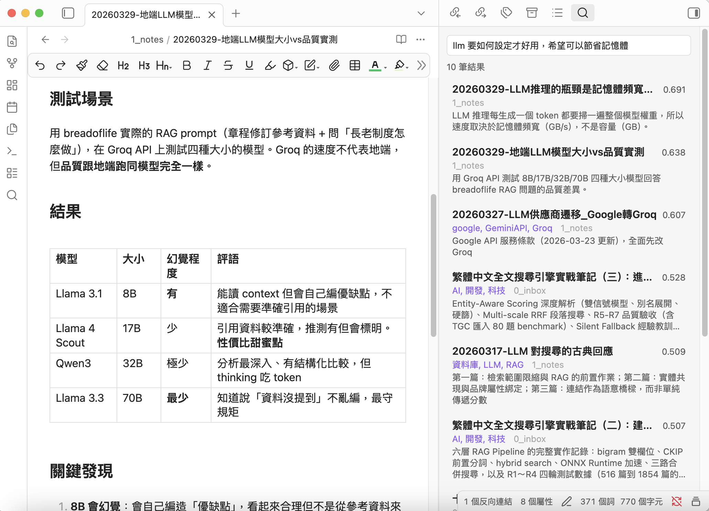
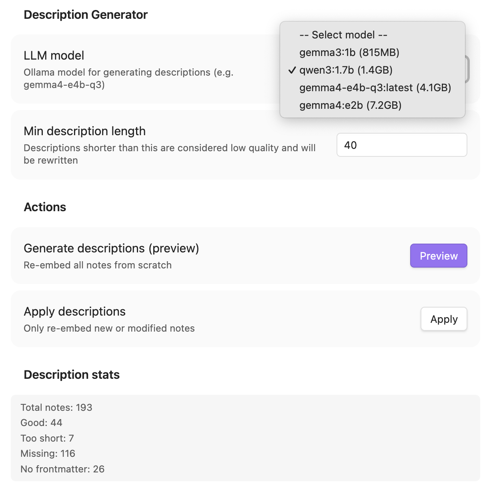

# 開源 Obsidian 語意搜尋插件 Vault Curate :)

我在 Obsidian 裡累積了幾十年前累積到現在的上千篇筆記，有時候明明記得某個想法，但就是搜不到，因為關鍵字完全想不起來，只記得大致的情境和內容。

Obsidian 內建搜尋是關鍵字比對，打「財務」不會找到標題叫「預算規劃」的筆記。Obsidian 上有一些相關的工具，其中 Smart Connections 就是非常棒的工具，它有語意搜尋等眾多功能，但他內建的幾個 embedding model 對於中文的處理都不太好，Pro 才能換比較合用的工具。其他插件不是模型同樣固定不能換，就是包山包海還帶有 Chat 功能的方案，我用不到啊。

所以我因為懶，又自己寫了一個 Obsidian 的 Plugin XD 

## Vault Curate 做什麼

**用你想表達的「意思」搜尋筆記，不只是關鍵字。**

你輸入一段模糊描述，它找到語意最相近的筆記，描述越具體越豐富，結果越精準。



## 為什麼我不用 LLM 分析完全取代筆記

前幾天 [Andrej Karpathy 在 X 上分享了他用 LLM 維護知識庫的做法](https://x.com/karpathy/status/2039805659525644595)，其中有一個脈絡是讓 AI「編譯」筆記成結構化 wiki，他不手動編輯任何東西，然後網路上非常多人討論也分享自己的工作流。

很酷，但我的想法不太一樣。

我認為**原始筆記本身有價值**，我寫下的每一篇，反映的是我當下的理解和思考脈絡。LLM 很強，他絕對可以重新找出精髓並發揮的很好，但它彙整出來的東西是它的理解（或許有學習我的風格），依然不是我的。

RAG 和語意搜尋的好處是：它們**跟你的內容協作**，幫你重新發現自己寫過的東西，而不是用 AI 的版本取代它。

這兩個思維並不衝突，我同時也有另一個自動化分析文章的工作流，但我最後總是喜歡自己動手來一遍，這會幫助我有更深刻領受。

所以 Vault Search 就是這樣的一個工具，它幫助你越來越淬煉自己的思維，用你自己的經驗 + AI 帶來的新知識。

## 幾個我覺得做得不錯的設計或堅持？

**完全本地** — 所有 embedding、索引、搜尋都在自己的電腦上跑，透過 Ollama 就可以完成。不需要 API Key，不需要付錢，筆記不會離開你的機器。

**8GB 就能用** — 我自己在 M2 MacBook Air 8GB 上開發和使用。（推薦的 `qwen3-embedding:0.6b` 只吃 375MB RAM，日常搜尋延遲 ~130ms）。

**中文搜尋真的比較好** — 這是我最在意的。很多 embedding 模型對繁體中文理解很差。`qwen3-embedding:0.6b` 在我的 A/B 測試中，Top-1 結果跟 BGE-M3（業界常用的中文友善模型）完全一致。

**LLM 自動生成描述** — 這是我最近研究 LLM 文字分析的經驗。用本地 LLM 為每篇筆記生成一段 50-100 字的摘要，存在 frontmatter 的 `description` 裡，之後 embedding 用這段摘要而不是原文，搜尋品質明顯提升。當然這部分可以由雲端 LLM 來做，但我有一點小小堅持，哈。



**Hot/Cold 智慧分層** — 有連結的筆記、近期建立的筆記自動標為 hot，搜尋時優先顯示。那些孤立的舊筆記不會稀釋你的搜尋結果，這是我覺得很有意思的小巧思。

## 推薦的使用流程

```
1. 生成 Description  →  2. 重建索引  →  3. 搜尋
```

先讓 LLM 為筆記寫摘要，再建索引，這樣 embedding 捕捉到的是精煉的語意，而不是原始的流水帳。

我自己的體感：跑完 description 之後，搜尋品質從「還行」變成「真的有用」。

## 安裝

Obsidian 的社群 第三方外掛程式通過囉 :)
可以直接安裝。

## 開源

MIT 授權，歡迎使用、回饋、貢獻，給我星星啊 XD

GitHub：https://github.com/notoriouslab/vault-curate

---
