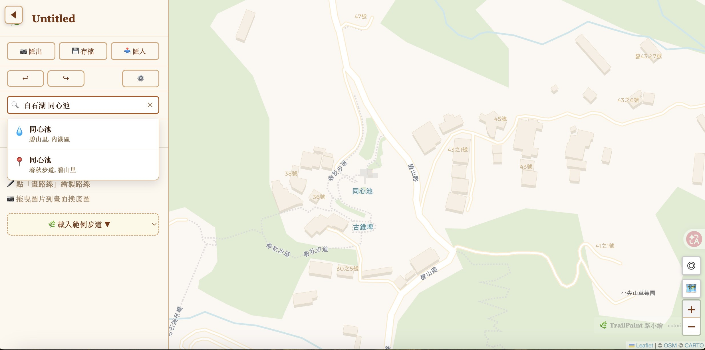
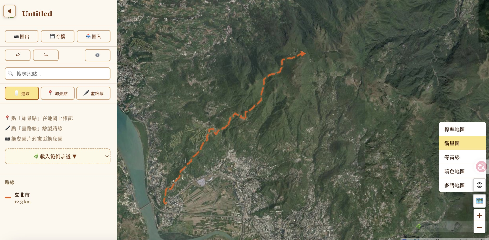
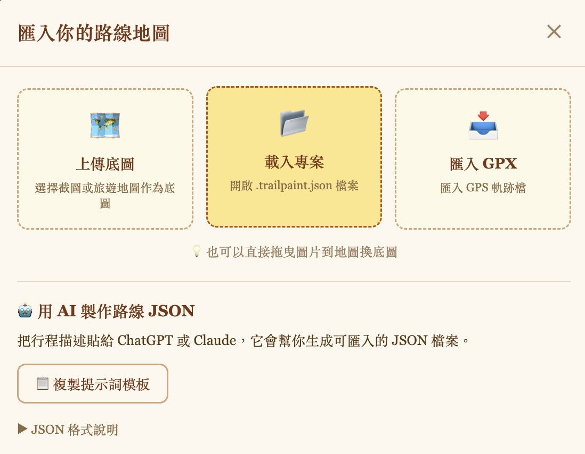
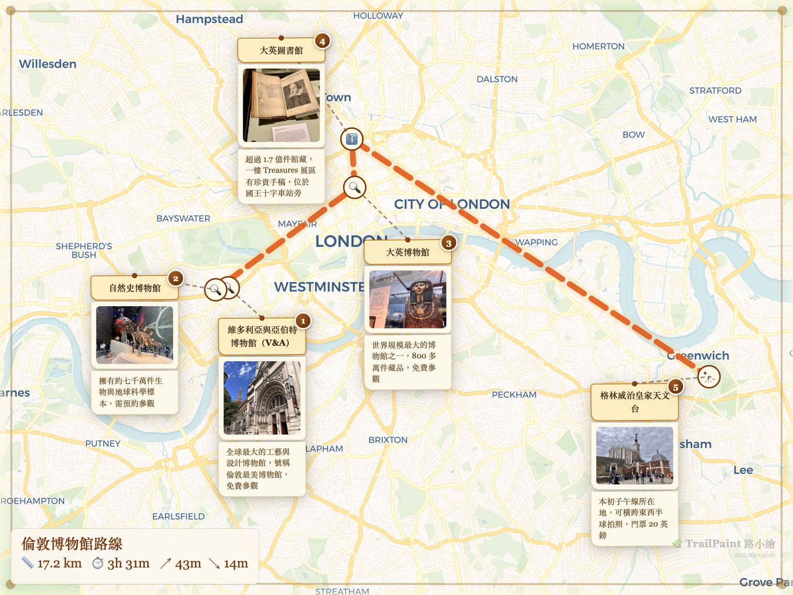
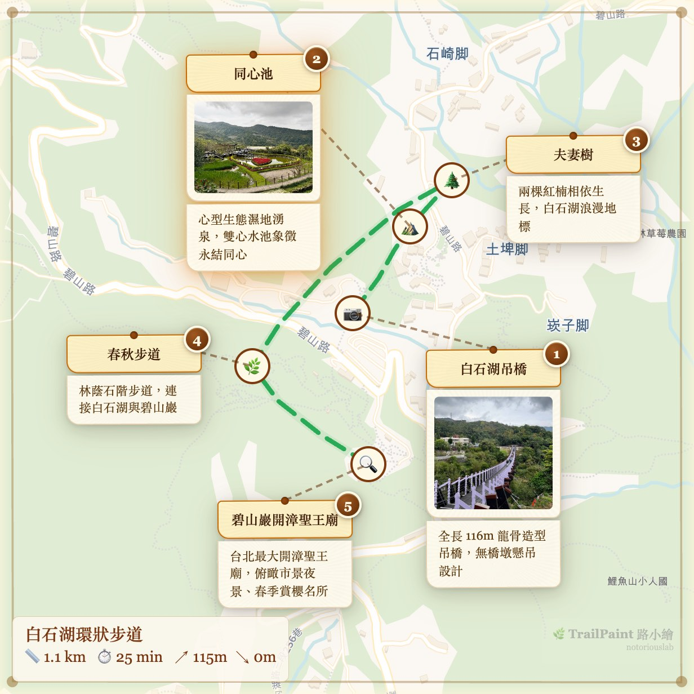
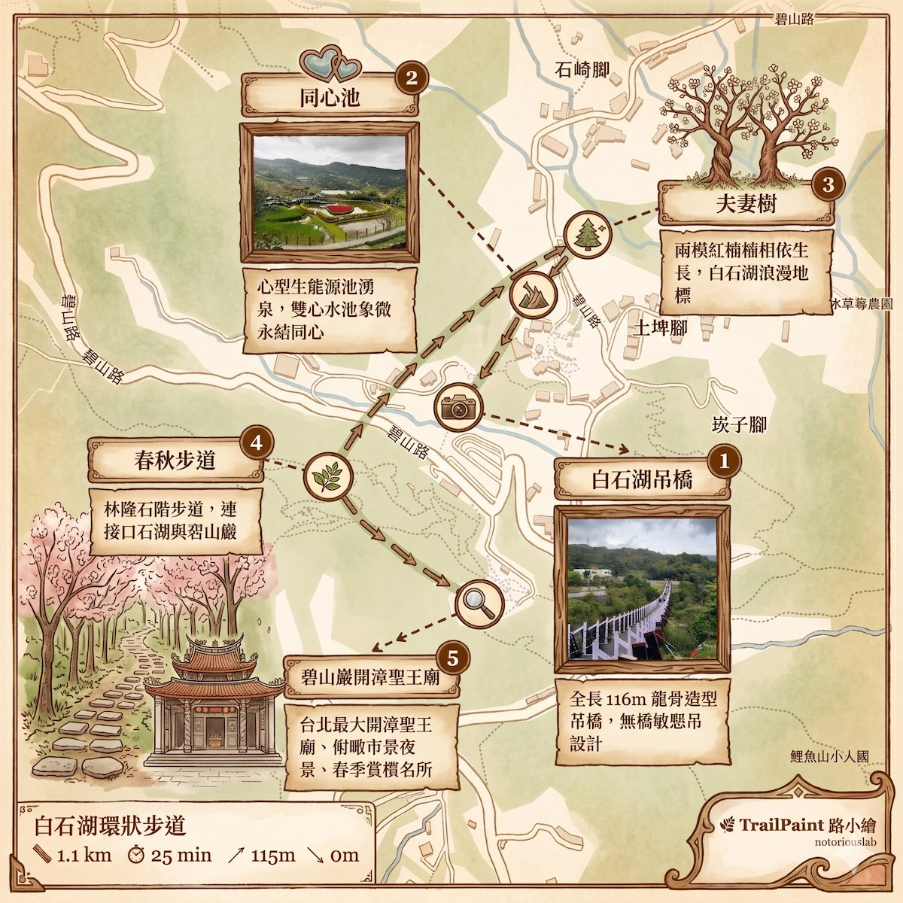
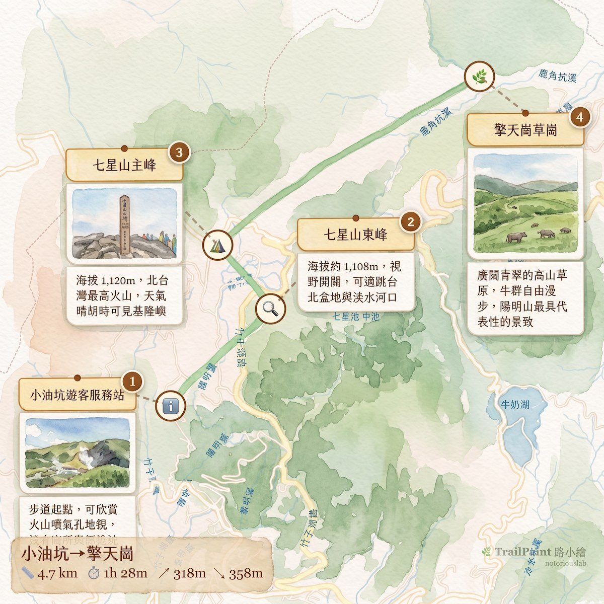

太太在 致福益人學苑開了「公園生態探索、戶外生態導覽」的課程，常常需要帶一些長輩們去台北近郊探索自然步道，她很習慣使用 Openstreet Maps 之類的工具輔助，上個月她問我如何透過 AI 在地圖上加上一些圖標、說明，然後做成一個簡單美觀的旅遊導覽地圖可以分享使用。

市面上已經有一些很棒的工具可以繪製旅遊地圖，透過 canva 也可以加上圖片或是說明，但我自己覺得整體用起來好像還是有點複雜，而且要開一堆網站來拷貝貼也很麻煩，所以我就決定用 AI 打造一個簡易好用的小工具，目標很簡單：**一張有溫度的旅遊路線圖，上面有景點、有照片、有距離資訊，而且五分鐘就能做完。**

拜 AI 工具的便利性，我搞出了 [TrailPaint 路小繪](https://trailpaint.org/app/)。

## 打開瀏覽器就能用的地圖導覽工具

不用下載、不用註冊。打開網站，搜尋你要去的地方，地圖就出現了。

左邊搜尋欄打幾個字（例如白石湖 同心池），地圖就會帶你到目的地，接下來就是畫路線、放景點和寫點說明。

## 放景點、貼照片、畫路線

點地圖就能放景點卡片，每個卡片可以寫名稱、加照片、選圖示。景點之間畫一條路線連起來，整張旅遊導覽地圖就成形了。

景點卡片有紙紋質感，看起來有一點像手寫的旅行筆記，目前預設 26 種圖示可以分類：包括集合地點、觀景、休憩等等 ⋯⋯ 大致上都可以找到對應的小圖標。

## 不只一種地圖

假如是騎車、爬山等，底圖可以切換到比較適合的圖層，例如走山路想看地形？切到衛星圖或等高線，市區散步想簡潔一點？用標準地圖或多語地圖。

如果你有 GPS 手錶或登山 APP 記錄的 GPX 軌跡檔，也可以直接匯入，軌跡自動變成路線，完全相容標準格式，網路上有很多人分享，都可以試試喔～

## 匯入方式很多元

除了自己動手標示，還有匯入精靈。GPX 檔案拖進去就好，甚至可以把行程描述丟給 ChatGPT 或 Claude，讓 AI 幫你產生景點 JSON，再匯入 TrailPaint。

比方說你跟 AI 說「我要從小油坑走到擎天崗，中間經過七星山主峰和東峰」，並讓 AI 參考我們的提示詞模板，它就會幫你產生一份包含經緯度和景點資訊的檔案，直接匯入就能用。

也可以將你的旅遊 Blog 文章連結提供給 ChatGPT 或 Claude，同樣讓 AI 幫你產生景點 JSON，再匯入 TrailPaint。下面就是我將之前去倫敦的博物館之旅日誌所製作出來的 json 檔案，直接匯入，再另外補上圖片，馬上就有一個簡單美觀的旅遊導覽圖出來囉～

## 匯出：選風格、選比例

地圖做好了，按匯出就會跳出預覽，可以選 IG 正方形或限動比例，套上不同的邊框風格。

目前有兩種主要風格，第一種是原始底色，地圖保持清晰，素描風格就 ... 那樣 XD

假如你希望可以更接近手繪風格，匯出後將圖檔結合「複製 AI 提示詞」功能，一起丟給 ChatGPT / Gemini 等 AI Agent 的建立圖像功能，就可以得到類似下圖的質感，有沒有很棒，哈哈～

底部會自動標上總距離、預估時間和爬升高度，不用自己算（數據是根據地圖與 GPX 軌跡自動推算，跟實際狀況可能有出入，當參考就好，出發前還是要做功課）～

## 再來一張：七星山

用同樣的方法做了一張小油坑到擎天崗的路線圖，4.7 公里、爬升 318 公尺，走起來很過癮的一條路線。

## 誰適合用？

想了想，我自己覺得應該很多人都可能用得到，所以就開放給大家免費使用：

- **登山、健行的人** — 出發前做一張路線圖傳到群組，讓隊友知道今天走哪裡
- **單車騎士** — 記錄騎乘路線，標記補給點和拍照點
- **旅行愛好者** — 自由行的散步路線，配上街拍照片就是一篇遊記
- **老師** — 校外教學路線圖，比文字說明清楚十倍
- **導遊、領隊** — 行程說明會的視覺素材，客人一看就懂
- **部落客** — 文章裡放一張手繪路線圖，比單純地圖截圖好看一些 XD

不需要任何設計底子，放景點、畫路線、按匯出，就這樣。

## 離線版

如果需要完全零網路的環境，可去 [Github](https://github.com/notoriouslab/trailpaint) 下載 [`trailpaint.html`](https://github.com/notoriouslab/trailpaint/blob/main/trailpaint.html) 單一檔案，電腦上用瀏覽器開啟即可使用。

> ⚠️ 離線版不包含線上地圖、GPX 匯入、海拔等功能。iOS 無法直接開啟本機 HTML。

## 免費開源

TrailPaint 路小繪 歡迎有興趣自己動手做的人依據自己的需求修改使用，可去 [Github](https://github.com/notoriouslab/trailpaint) 參考。

唯版權採用 GPL-3.0 License — 自由使用與修改，衍生作品必須同樣以 GPL-3.0 開源。

## 免責聲明

TrailPaint 是路線記錄與分享工具，不是導航軟體。距離、時間、海拔等數據根據地圖與 GPX 軌跡自動推算，可能與實際狀況有出入，僅供參考。地圖底圖資料來自 OpenStreetMap 等第三方服務，不保證即時或完全正確。戶外活動請自行做好行前規劃，並以現場實際狀況為準。

## 歡迎各種型態的鼓勵與贊助 XD

歡迎 PR 和 Issue！不管是回報 bug、建議功能、還是分享你做的路線地圖，都非常歡迎，記得去 [Github](https://github.com/notoriouslab/trailpaint) 幫我按個星星也很感激。

若是有旅行社或是國家公園願意讓我們去玩更好，哈哈 :P

---

**TrailPaint 路小繪**：[https://trailpaint.org/app/](https://trailpaint.org/app/)

免費、開源、資料存在你自己的瀏覽器裡，不會上傳到任何伺服器，手機、平板都能用。
