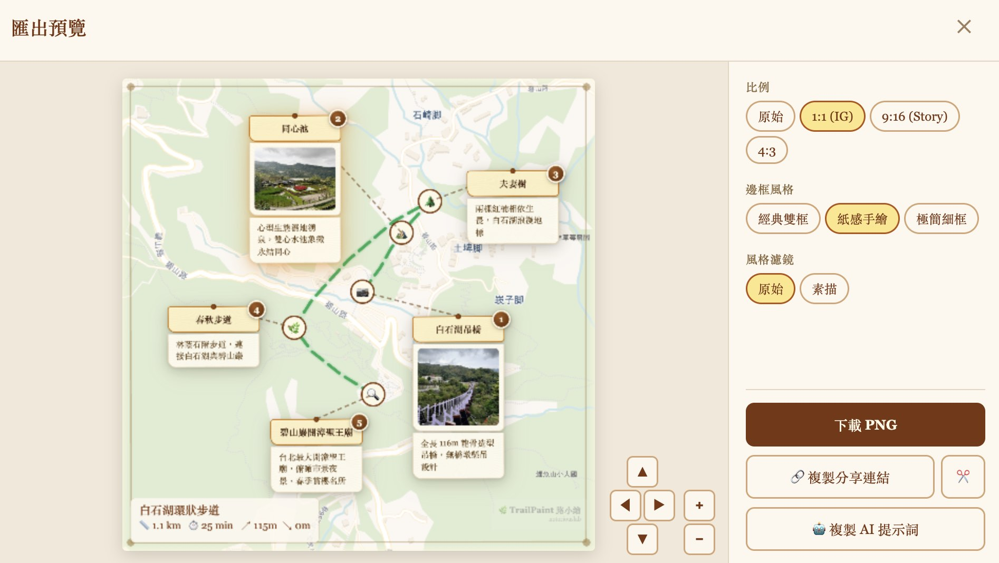

# A photo-map editor with no database, no login, and one Cloudflare Worker

My wife teaches outdoor-nature walks in Taipei and kept asking me for a simple way to make trail maps for her class handouts — a map with her photos, a route drawn between them, exportable as a PNG she can hand to elderly students. Existing tools either didn't quite fit or wanted her to wrestle with Canva, so I built [TrailPaint](https://trailpaint.org/app/) over a handful of weekends.

Somewhere along the way I noticed I hadn't written any backend code. I still haven't. The whole thing runs in the browser tab, and the only server-side code in the repo is a ~370-line Cloudflare Worker that takes a compressed project blob and gives back a short URL. Tile rendering, EXIF parsing, PNG export, GPX/KML import, geocoding — all client-side. Projects live in IndexedDB. The Worker is effectively a URL shortener that happens to render Open Graph tags.

That accidental constraint is what made the project actually fun to work on. Below are five things I expected to need a server for and didn't, plus the bugs I hit along the way. Most of them involve iOS Safari doing something unpleasant.


## 1. Exporting the map as a PNG — the iOS Safari trap

First attempt: grab [html-to-image](https://github.com/bubkoo/html-to-image), point it at the Leaflet container, call `toPng`. Works on desktop. Works on Android Chrome. Works on iPad. Then I tried it on iPhone Safari at `pixelRatio: 3` and got a PNG where every photo was a blank rectangle. No error. Just... gone.

html-to-image's trick is to clone your DOM into an SVG `foreignObject`, rasterize that SVG through an ``, and pull the pixels back out. Clever, but WebKit doesn't play nice with it in two specific ways. First, cross-origin images inside a `foreignObject` silently fail to decode on iOS Safari at higher pixel ratios. The SVG rasterizes, but any `` inside it comes back broken — tiles from CartoDB, spot photos, gone, nothing thrown. Second, vector tiles: [protomaps-leaflet](https://protomaps.com/) renders to `<canvas>` elements, and `foreignObject` can't serialize canvas contents into the SVG at all. So any vector basemap exports as a white rectangle regardless of OS.

I rewrote the capture as a three-step hybrid. Draw the tiles (raster and vector) straight to a canvas with `drawImage`, which is reliable everywhere with `crossOrigin`. Use html-to-image for the overlay layer — routes, pins, card borders — but filter out tiles and photos so `foreignObject` never touches cross-origin images. Then draw the photos on top of the overlay, replicating `object-fit: cover` and the CSS border-radius clip by hand.

```ts
// 1. Tiles → canvas directly
drawTilesToCanvas(ctx, mapEl, containerRect, dpi);

// 2. Overlay via html-to-image, filtered
const overlayDataUrl = await toPng(mapEl, {
  pixelRatio: dpi,
  filter: (node) => {
    const el = node as HTMLElement;
    if (el.tagName === 'IMG' && el.closest('.spot-card__photo-wrap')) return false;
    if (el.tagName === 'CANVAS' && el.closest('.leaflet-tile-pane')) return false;
    return true;
  },
});
ctx.drawImage(overlayImg, 0, 0);

// 3. Photos → canvas on top
drawPhotosToCanvas(ctx, mapEl, containerRect, dpi);
```

Two smaller surprises while I was at it. iOS Safari silently produces a blank canvas when its pixel count exceeds roughly 16 million. Not an exception. Not a warning. You just get a blank PNG and spend an afternoon reading forum posts from 2019. The cap in the code is `MAX_CANVAS_PIXELS = 16_000_000`, and it auto-downgrades `pixelRatio` until the canvas fits. The other surprise: vector tiles render asynchronously into their canvases, so capturing too early leaves half the map blank. There's a polling loop that samples one alpha pixel per tile-pane canvas and waits up to a second and a half for content to appear.

None of this complexity exists if you spin up a Node service with headless Chrome and render the PNG server-side. But then you have a Node service, and a queue, and a photo upload pipeline, and a bill. I'd rather ship three functions and a sixteen-million-pixel magic number.

## 2. Image-mode: user-uploaded backgrounds, and the haversine trap

Some people wanted to draw routes over scanned maps, theme-park illustrations, old hiking brochures. Leaflet handles this out of the box with `CRS.Simple` — you give it an image and it treats the pixels as the coordinate system.

Which means every line of code I'd written assuming real-world lat/lng was quietly doing haversine math on pixel distances. The numbers it returned weren't meters, weren't pixels, weren't anything useful — just wrong, with confident decimals. Elevation lookups to [Open-Meteo](https://open-meteo.com/) came back NaN.

The fix wasn't clever: eleven guards across `ExportWizard.tsx`, `RouteEditor.tsx`, and `Sidebar.tsx`, all gated on `baseMode === 'image'`, hiding the UI that would otherwise display garbage. Distance stat in the sidebar. Elevation profile. The "fetch elevation" button. The stats strip on the export. The elevation fetch inside the store short-circuits too. What was interesting wasn't the guards, it was the mental shift: in an app with a narrow audience you can just strip the feature when the number would be wrong, and that option doesn't really exist when you're writing a general-purpose library.

## 3. Sharing a project that includes photos



A project is a JSON blob: spots, routes, photo blobs (as base64), map state. Small project with no photos fits fine in a URL hash if you're willing to stare at a 2 KB URL. Big project with 20 photos at 2 MB each: 40 MB of payload, not going anywhere near a URL.

For the URL-hash case, there's `CompressionStream('deflate')` — pipe the JSON through it, base64 the output, stick it on the hash. Deflate gets about 3–4× on this kind of payload. I skip photos in the hash since I didn't want to test URL-length limits any harder than necessary.

```ts
const cs = new CompressionStream('deflate');
const stream = new Blob([JSON.stringify(project)]).stream().pipeThrough(cs);
const compressed = new Uint8Array(await new Response(stream).arrayBuffer());
return base64Encode(compressed);
```

When the project has photos, the client runs the same deflate pass and POSTs the compressed blob to the Worker. The Worker drops it into Cloudflare KV with a TTL, hands back an 8-character ID, and you get `trailpaint.org/s/abc12345`. When someone opens that URL, the Worker pulls the blob back and returns it; the client decompresses and rehydrates. Photos travel with the payload.

Worth noting what the Worker is specifically not doing: parsing the project, thumbnailing photos, running any image pipeline. The bytes go in compressed, the bytes come out compressed. It's a redis-backed gist clone, except Cloudflare is the redis and I didn't have to run it.

## 4. Everything else: GPX, EXIF, geocoding

The rest of what looked like it might need a server turned out not to. GPX, KML, and GeoJSON import is just `DOMParser` and a few hundred lines of parser code; the user drags a file in and it's parsed in place. Reverse geocoding uses [Photon](https://photon.komoot.io/) primary, Nominatim fallback — both public OSM-based APIs the browser calls directly, no proxy. Map tiles come straight from their CDNs: OpenStreetMap, CartoDB, [protomaps](https://protomaps.com/) vector tiles, plus [DARE](https://dh.gu.se/dare/) (Roman-era Mediterranean) and [CCTS](https://ccts.sinica.edu.tw/) (historical Chinese dynasties) for the history-nerd basemaps. EXIF parsing is [exifr](https://github.com/MikeKovarik/exifr) with [ExifReader](https://github.com/mattiasw/ExifReader) as a dynamically-imported fallback for the iPhone 17 HEIC variant that exifr's `ftyp` sanity check silently rejects — [I wrote that story up separately](/blog/20260421-rescuing-ios-18-heic-exif-in-a-browser-only-app/).

## The Worker itself

`cloudflare/share.worker.js` is about 370 lines including comments, validation, and the OG rendering. Three endpoints. `POST /api/s` takes a compressed blob up to 5 MB, validates the envelope, mints an 8-character ID, writes to KV, returns the ID. `GET /s/:id` pulls the blob and renders an HTML page with Open Graph tags — title, first-photo cover, description — so previews on LINE, X, Threads, and Slack look decent; the hash is embedded in the page and the client hydrates from it. `GET /s/:id/cover.jpg` extracts the cover directly for OG bots that don't run JavaScript.

Two Cloudflare features do real work. A WAF rule rate-limits writes to 30 per 10 seconds per IP, with a 1-hour block on burst. An Analytics Engine counter gives me a rough "how many shares per day" number so I know if something's badly broken. No user accounts, no auth, no editing — if you want to change a share, you re-share and get a new ID. Not elegant, but it removes a whole category of problems.

## What it costs me

I've been selling the no-backend framing pretty hard, so here's the other side.

There's no device sync, because there are no accounts. Build a project on your laptop and want to finish on your phone? Export the JSON, reimport. Not ideal, and this is the #1 thing people ask me about. Export is slow on old phones: a 20-photo map on a six-year-old Android takes 10–15 seconds to render, which a headless-Chrome service would do in under a second (and would also require me to run a headless-Chrome service). Memory is whatever the browser gives you; the import pipeline downscales photos to a 600px longest edge at JPEG quality 0.7, which typically turns a 5 MB iPhone shot into roughly 40 KB, but a project with fifty of those plus vector tiles can still push a mobile tab past a gigabyte. And it's not really offline: tiles and geocoding still need network. There's a separate single-file HTML build for workshops, but that's a secondary artifact.

## Closing notes

The thing I'd actually tell anyone considering this kind of architecture is: iOS Safari is the real spec. Every interesting bug in this codebase is something iOS WebKit did. The desktop browsers almost never caught anything WebKit didn't, and a bug that works on iOS works everywhere. Test there first.

The no-server constraint also forced me to learn a pile of things I wouldn't have otherwise — that Leaflet has a `CRS.Simple` mode, that `CompressionStream` ships in every evergreen browser, that iOS has a 16-million-pixel canvas ceiling that fails silently. None of those would have surfaced if I'd stood up a Rails app and piped everything through a controller. The one thing the server actually earns its keep on is giving me a URL that outlives the user's tab. That's fine. Use the server for the thing only the server can do.

Source is on GitHub under GPL-3.0: [github.com/notoriouslab/trailpaint](https://github.com/notoriouslab/trailpaint). The hybrid capture lives in `online/src/map/ExportButton.tsx`, the share compression in `online/src/core/utils/shareLink.ts`, and the Worker in `cloudflare/share.worker.js` if you want to poke at any of it. Always curious what I got wrong — I'm sure iOS has a few booby traps I haven't tripped yet.


