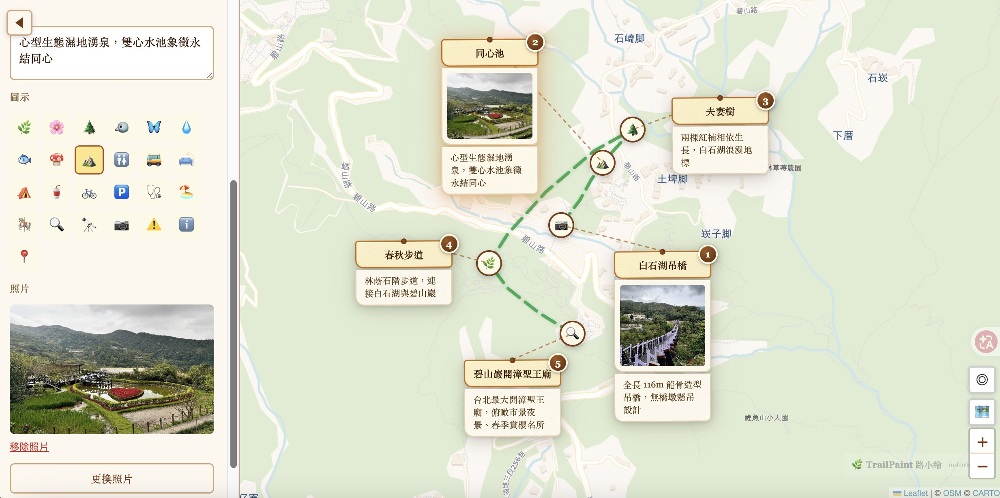

# Rescuing EXIF GPS from iPhone 17 HEIC, in a browser-only app

My wife teaches outdoor-nature classes in Taipei and drops photos into [TrailPaint](https://trailpaint.org/app/), a small browser-only tool I built so she could make trail maps for her class handouts without wrestling with Canva. Drag GPX in, drop photos on the map, export a PNG. The whole thing runs in the tab.

One of the features she relies on is auto-placement: drop twenty photos and each one lands on its own spot because the browser reads the EXIF GPS tag and drops a card there. It's the part of the product that feels most like magic when it works.

Then she upgraded to an iPhone 17, and every photo she dropped piled up at the map center.



## The diagnosis

First suspicion: exifr. We use [exifr](https://github.com/MikeKovarik/exifr) as the primary EXIF reader — small, fast, tree-shakes to ~18 KB. It was returning an object with everything _except_ latitude and longitude. No throw, no warning, just `undefined`.

I diffed two HEICs side by side — a 2026 photo from my wife's iPhone 15 Pro (iOS 18, which still parses fine) against a photo from her iPhone 17 (iOS 26.3, which breaks). The raw hex tells the story.

HEIC is ISOBMFF, the same container format as MP4. The very first box is `ftyp`, which declares the major brand plus a list of compatible brands. The first four bytes of the box give its total size in bytes, big-endian:

```
iPhone 15 Pro / iOS 18:  ftyp size=44  brands (7):
    heic mif1 MiHB MiHE MiPr miaf heic tmap

iPhone 17      / iOS 26: ftyp size=52  brands (9):
    heic mif1 MiHB MiHA heix MiHE MiPr heic miaf tmap
```

Note that both files already include `tmap`, Apple's marker for tone-mapped adaptive HDR. That isn't what broke things — the iPhone 15 Pro file has it too, and it parses. What broke is the two additional compatible brands in the iPhone 17 output: `MiHA` and `heix`. Each compatible brand takes four bytes, so two new ones bump the `ftyp` box from 44 to 52 bytes.

Which matters, because exifr has a hard-coded `ftyp` length sanity check:

```js
// src/file-parsers/heif.mjs
let ftypLength = file.getUint16(2)
if (ftypLength > 50) return false
```

iPhone 15 Pro's 44-byte `ftyp` passes. iPhone 17's 52-byte `ftyp` doesn't. `HeifFileParser.canHandle()` returns false, exifr falls through every other file parser, and the caller sees `"Unknown file format"` — even though the EXIF payload inside the file is entirely intact. The parser just never got to it.

## The fix that doesn't bloat the bundle

Three options went through my head. An upstream patch to exifr is the right long-term move, but my wife was sitting on broken photos that weekend. Swapping the whole parser to [ExifReader](https://github.com/mattiasw/ExifReader) — which does handle these files — would fix it, except ExifReader is roughly five times bigger, and I'd be shipping that weight to every user regardless of whether they're on one of the few HEIC variants that actually triggers the bug. The third option, and the one I went with, is a fallback chain: keep exifr as primary, dynamically import ExifReader only when exifr gives up on a HEIC. (I've also filed this upstream at [exifr#138](https://github.com/MikeKovarik/exifr/issues/138) with the byte-level repro — the fix is a one-line ceiling bump that would help everyone on exifr.)

```ts
const { gps, meta } = await tryExifr(file);
if (gps !== null || meta !== null) return { gps, meta };

// exifr gave up on the file entirely. Try the heavier parser.
const [{ default: ExifReader }, buf] = await Promise.all([
  import('exifreader'),
  file.arrayBuffer(),
]);
if (!isBmffSafeToParse(buf)) throw new Error('HEIC iloc structure rejected');
return parseWithExifReader(buf, ExifReader);
```

Two things I like about this. First, the main bundle doesn't move — ExifReader lives in its own ~34 KB gzip chunk that only downloads when needed. A user on an older iPhone, on Android, or on a desktop dragging JPEGs pays zero cost for a problem they don't have. Second, the fallback is bounded: it only fires when exifr produced _nothing_ — no GPS, no metadata — which is the specific failure mode we're trying to rescue. A normal photo that just happens to lack GPS still short-circuits after a single pass.


## Four hardening doors

Adding a second parser meant adding a second attack surface. TrailPaint's threat model is genuinely small — users drop their own photos into their own browser, the bytes never leave — but "small" isn't "zero", and ExifReader's BMFF code has known rough edges. Four guards, cheapest first:

**1. Null Island rejection.** Coordinates `(0, 0)` sit in the Gulf of Guinea. Almost no one took a photo there. Broken EXIF parsers, on the other hand, return `(0, 0)` all the time. We reject it. The cost is that the three people actually photographing buoys near 0°N 0°E have to drag their spots manually; the benefit is that a parser regression can't quietly scatter your photos into the Atlantic.

**2. `DateTimeOriginal` regex anchor.** The obvious regex `/^\d{4}:\d{2}:\d{2}/` looks fine until you realize an earlier draft of mine was `/\d{4}:\d{2}:\d{2}/` — no anchor, no `$`. That one happily matches the middle of arbitrary strings. Not a security bug, but it was silently accepting garbage dates. Anchor both ends.

**3. `MAX_PHOTO_BYTES` guard.** The wrapper rejects files larger than 10 MB before any bytes reach the parser. Camera JPEGs run 2–5 MB, recent iPhone adaptive-HDR HEIC with a gain map sometimes pushes 8 MB, Live Photos can nudge higher. 10 MB is generous for a single-frame photo without inviting someone to feed us 50 MB and watch the tab OOM. If a legitimate photo trips it — rare but possible with multi-frame composites — the user's options today are downscale in their Photos app or file an issue and I'll raise the cap; I'd rather start strict and loosen later than the reverse.

**4. `isBmffSafeToParse` pre-scan.** This is the interesting one. ExifReader walks the ISOBMFF `iloc` box to enumerate metadata extents, and it trusts the fields in that box. Two known attack signatures live there. The first is an `iloc` where both `offset_size` and `length_size` are zero; that packs the extent iteration into a `65535 × 65535` nested loop whose inner step advances by zero bytes, which pegs the main thread indefinitely. The second is an `item_count` inflated to millions or billions — ExifReader dutifully iterates. Real iPhone HEICs carry around 2–15 items (primary image, thumbnail, depth, HDR gain map, EXIF, XMP); anything past that is almost certainly malicious.

The pre-scan walks the top-level boxes, descends into `meta` (which is a FullBox, so its sub-boxes start 4 bytes after the header), finds `iloc`, and rejects the two signatures:

```ts
// Walk top-level boxes, find `meta`
let pos = 0;
while (pos + 8 <= max) {
  const size = v.getUint32(pos);
  if (size < 8) return true; // 64-bit / open-ended — bail, let parser try
  if (boxType(v, pos) === 'meta') {
    // meta is a FullBox: skip 4 bytes of version+flags
    let q = pos + 8 + 4;
    while (q + 8 <= pos + size) {
      if (boxType(v, q) === 'iloc') {
        const ilocVersion = v.getUint8(q + 8);
        const sizeByte = v.getUint8(q + 12);
        const offsetSize = (sizeByte >> 4) & 0x0f;
        const lengthSize = sizeByte & 0x0f;
        // Attack 1: non-terminating extent loop
        if (offsetSize === 0 && lengthSize === 0) return false;
        // Attack 2: absurd item_count
        const itemCount = ilocVersion < 2
          ? v.getUint16(q + 14)
          : v.getUint32(q + 14);
        if (itemCount > ILOC_ITEM_CAP /* 1000 */) return false;
        return true;
      }
      q += v.getUint32(q);
    }
    return true;
  }
  pos += size;
}
return true;
```

A few details worth noting. The scan only looks at the first 256 KB of the buffer — metadata boxes sit at the start of an ISOBMFF file, and capping the scan window prevents the pre-scan itself from being a DoS vector on large inputs. If the file doesn't start with `ftyp`, the scan returns true and lets the parser decide (we only care about genuine HEIC). The `ILOC_ITEM_CAP = 1000` is two orders of magnitude above real files and still cheap to enforce. The scan is roughly 40 lines in the actual source (`exifParser.ts`).

## Why not a Web Worker

The textbook answer to "untrusted parser on user-supplied binary" is "run it in a Worker." I considered it and walked away. The attack surface here is genuinely tiny — users drop their own photos into their own browser, nothing goes to a server, there's no shared link that carries a photo. Against that, a Worker adds a second chunk, buffer transfer via `postMessage`, serialization overhead, and async orchestration around what's currently one `await`. The `iloc` pre-scan is forty synchronous lines that block exactly the class of file I was worried about, at the boundary, before the parser runs. Ceremony without a matching risk is its own cost. If the threat model changes — say I add a server-side path that accepts shared photos — the Worker comes back on the table.

## Closing notes

The thing I'd take away from this isn't the patch itself but the shape of the problem. BMFF is a moving target: Apple added `tmap` with iOS 18, then tacked on `MiHA` and `heix` somewhere between iOS 18 and iOS 26, and they'll add something else next year. Any parser that reads container metadata is going to need a fallback story rather than a hope, and shipping that fallback via dynamic import is a nice way to keep the happy path cheap for the vast majority of users who never trigger it.

The other useful shift was matching guards to reality instead of textbook. Hardening a browser tool where the user is both attacker and victim is a different problem than hardening a public upload endpoint. The correct guards here turned out to be smaller than the security-textbook answer would suggest — a cap on file size, two specific `iloc` attack signatures, and a couple of value-range checks. No Worker, no WASM sandbox, no quarantine queue. Just the bits that actually matched the risk.

Source is on GitHub under GPL-3.0: [github.com/notoriouslab/trailpaint](https://github.com/notoriouslab/trailpaint). The EXIF pipeline and the four guards live in `online/src/core/utils/exifParser.ts`; the size caps are in `exifToGeojson.ts`. Upstream issue at [exifr#138](https://github.com/MikeKovarik/exifr/issues/138) if anyone wants to chime in. Happy to hear what I got wrong — BMFF always has another booby trap.
